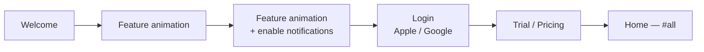
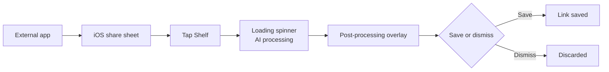
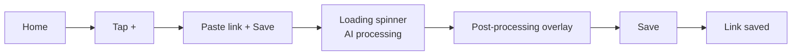
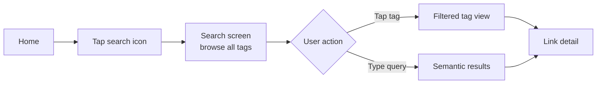

# Shelf — Product Requirements Document

> Design system (colours, typography, spacing, libraries): see [DESIGN.md](DESIGN.md).

## 1. Overview

**App name:** Shelf
**Tagline:** Save anything. Find everything.
**Platform:** iOS (v1)

### Problem

Content consumption is fragmented. YouTube Watch Later, Instagram Collections, browser bookmarks, Pinterest boards — a saved link ends up in the wrong silo or is never found again. Existing tools (Raindrop, Mymind) either lack intelligence or have poor UX. Nobody nudges you back to what you saved.

### Solution

Shelf is a unified content-saving app. Share any link from any app — Shelf parses the content, AI assigns tags automatically, and semantic search finds it even if you search with different words. A per-link reminder ensures saved content doesn't rot.

### Target user

People who actively consume content across multiple platforms and suffer from the "saved to never return" problem — learners, researchers, content creators, professionals building knowledge in a domain.

---

## 2. Competitive landscape

| App | What it does well | Why it falls short |
|---|---|---|
| Raindrop.io | Share extension, link storage, cross-platform | No AI tagging, no semantic search, no reminders, dated UI |
| Mymind | AI tagging concept, clean idea | Weak semantic matching (soy ≠ soya), cluttered UI, expensive |
| Pocket / Instapaper | Read-later for articles | Articles only, no video, no AI |

### Shelf's differentiation

- Truly semantic search (embeddings, not keyword matching — soy surfaces soya)
- AI tagging from actual content (YouTube transcripts, Instagram captions, full webpage text)
- Per-link reminders to consume saved content
- Warm, spacious, breathing-room UI — the opposite of Raindrop's file-manager feel

---

## 3. Design language

### Philosophy

The app should feel like a clean desk — calm, organised, never cluttered. Every interaction should feel effortless. The user should feel relief when opening the app, not anxiety.

### Visual

- **Colours:** Warm, light palette. Off-whites, warm creams, soft warm accents. No dark/daunting surfaces.
- **Spacing:** Generous. Cards have breathing room. Nothing is cramped.
- **Typography:** Clean, readable, minimal weight variation.
- **Corners:** Consistently rounded, friendly.

### Micro-interactions

- Scroll bar on projects view shrinks with a bouncy animation at scroll extremes
- Link detail thumbnail shrinks slightly as user scrolls up (parallax)
- Create project bottom sheet slides up from bottom
- Post-processing overlay slides up after loading spinner completes
- Tab switch: smooth horizontal slide

---

## 4. Monetisation

| | |
|---|---|
| Free trial | 5 days, full access |
| Monthly | $3.00 / month |
| Annual | $30.00 / year |
| Payment | Apple In-App Purchase (Apple takes 15–30%) |
| Auth | Apple Sign In + Google Sign In (no email/password in v1) |

---

## 5. V1 Scope

### In

- iOS share extension (save from any app)
- Manual link input (paste field inside app)
- Content parsing:
  - **Websites:** title, thumbnail, full page text (for AI tagging only), meta description
  - **YouTube:** title, thumbnail, description + transcript (unofficial API, async)
  - **Instagram:** caption + thumbnail (HTML scraping, accepted fragility — public posts only)
- AI auto-tagging: 10 tags per link, user can add more manually
- Every link auto-assigned `#all` tag
- Project organisation (optional — links are first-class without a project)
- Semantic search via embeddings (pgvector, Supabase)
- Per-link reminder toggle (push notification)
- Top 5 tags by frequency in tab bar
- Warm, spacious UI

### Out (v2+)

| Feature | Reason deferred |
|---|---|
| Read-only link sharing | Nice, not core to the save→find→consume loop |
| Collaborative collections | Significant scope |
| Android | Validate on iOS first |
| Notes/annotations on links | Useful but not the core thesis |
| YouTube transcript in search | v1 uses transcript for tagging; full-text search excluded |

---

## 6. Screens

### 6.1 Onboarding (first-time opening)

**Flow:** Welcome → Feature animation → Feature animation + enable notifications → Login → Free trial / Buy now → Home (`#all`)

- 2–3 feature animation screens highlighting core value props
- Notification permission requested on 3rd onboarding screen
- Login screen: "Continue with Apple" (black) + "Continue with Google" (white), privacy note at bottom
- Pricing screen: 5-day free trial or Buy now — $3/month or $30/year

---

### 6.2 Home screen

**Header:**
- `☰` hamburger menu — far left, opens left sidebar drawer
- "Shelf" — centred
- `🔍` search icon — far right

**Tab bar (below header, horizontally scrollable):**

`projects` | `#all` (default, underlined on load) | top 5 tags by frequency (scrollable)

**Projects tab:**
- 2-column grid of project cards
- Each card: auto-generated 2×2 thumbnail collage from first 4 link thumbnails (fallback: warm gradient + project name)
- Custom scroll bar with bouncy/shrink animation at extremes

**Tag tabs (`#all` + individual tags):**
- Links grouped by week in descending order
- Each week group: 2.5-column horizontal scroll row
- Each card: thumbnail + name + source platform icon

**FAB:** `+` bottom right — opens manual add flow

---

### 6.3 Post-processing overlay

Triggered after loading spinner (share extension or manual add). Slides up as an overlay on the current screen.

**Fields:**

| Field | Behaviour |
|---|---|
| Name | Editable, AI pre-filled |
| Tags | Editable, 10 AI pre-filled; user can add more |
| Project | Editable, autocomplete from existing projects, optional |
| Link | Immutable |
| Summary | AI-generated, immutable |
| Reminder | Push notification toggle |

**Actions:** Save button + swipe down to dismiss

---

### 6.4 Link detail screen

**Header:** Large thumbnail — shrinks slightly on scroll (parallax). Tapping thumbnail opens original URL in Safari.

**Body:**
- NAME (tap to edit)
- Source platform icon (Instagram / YouTube / Website)
- Summary (immutable)
- Tags (editable)
- Reminder toggle (editable)

**Footer:**
- Persistent "Open" button — opens original URL
- Delete button below Open

---

### 6.5 Search screen

**Empty state (no query):**
- Search bar at top (auto-focused)
- "Browse by tag" label
- All tags as flowing wrap of pill chips — tap to filter

**Results state (query typed):**
- Semantic search results (embeddings — soy surfaces soya)
- Same card format as main feed (thumbnail + name + source icon + tags)
- Results update as user types (debounced)

---

### 6.6 Create project

Tap `+` on home → bottom sheet slides up:
- Drag handle at top
- "New project" label
- Single text input (auto-focused, keyboard appears) — **20 character limit**
- "Create" button (disabled until name is entered)

Project name is stored and displayed in title case (e.g. "app launch ideas" → "App Launch Ideas").

Project thumbnail auto-generates as links are added (2×2 collage of first 4 link thumbnails, fallback warm gradient + name).

---

### 6.7 Settings (sidebar drawer)

Triggered by `☰` — slides in from left.

**Sections:**
- Account (profile photo, name, email)
- Subscription (current plan, manage via Apple IAP)
- Notifications (global toggle)
- About (version, privacy policy, terms of service)

---

### 6.8 Empty states

**Home (`#all`, no links saved):**
Bookmark icon in a circle + "Nothing saved yet" + "Share any link to Shelf from any app, or tap + to add one manually."

**Empty project:**
"No links in this project yet." + add link button.

---

### 6.9 Project detail

Triggered by tapping a project card from the Projects tab.

**Header:**
- `←` back arrow — far left
- Project name — centred (replaces "Shelf" logo), displayed in title case
- Font size shrinks to fit on a single line for longer names (max 20 chars)
- `🔍` search icon + `✏️` pencil icon — far right (search left of pencil)

**Search:** Scoped to this project's links only.

**Tab bar:** Same horizontal scroll tag bar as home. Tapping a tag navigates to the global tag view for that tag (not filtered within the project).

**Body:**
- Links in this project grouped by week in descending order
- Same 2.5-column horizontal scroll rows as the tag feed
- Same card format: thumbnail + time badge + colour-split title

**FAB:** `+` bottom right — opens manual add flow with this project pre-selected.

**Edit / delete (pencil icon):**
Opens a bottom sheet (same pattern as create project):
- Drag handle at top
- "Edit project" label
- Rename text input (pre-filled with current name)
- "Save" button
- Red "Delete project" option below Save

**Empty state:** "No links in this project yet." + add link prompt.

---

## 7. User flows

### 7.1 First-time opening

---

### 7.2 Share from external app

---

### 7.3 Manual add

---

### 7.4 Search

---

## 8. Technical decisions

> Stack TBD — see tech stack discussion.

### Semantic search

- **Embeddings:** OpenAI `text-embedding-3-small` → pgvector on Supabase
- **Index:** HNSW for sub-50ms query speed at any realistic per-user scale
- **What gets embedded:** `raw_content + current name + current tags` concatenated into one vector per link
- **Re-embedding on edit:** Synchronous on save when name or tags change (negligible latency ~300ms)
- **`raw_content` field:** Immutable, stored permanently per link, used as the base for all future embedding generations. Never overwritten.

### AI tagging

- LLM API call per saved link on save/share
- 10 tags returned. Dirt cheap — fractions of a cent per link.
- Async processing: share → loading spinner → AI tags → post-processing overlay pre-filled

### Content parsing

| Source | Method | Notes |
|---|---|---|
| YouTube | Official oEmbed/Data API + unofficial transcript API | Transcript fetch is async; fallback to title + description if unavailable |
| Instagram | HTML scraping of public pages | ToS risk accepted; public posts only; maintenance liability |
| Websites | Full page text fetch | Full text → AI for tagging; search operates on tags + title only (not raw page text) |

### Data model (key fields per link)

| Field | Mutable | Notes |
|---|---|---|
| `raw_content` | No | Base for all embedding generations |
| `name` | Yes | AI pre-filled, user editable |
| `tags` | Yes | 10 AI pre-filled, user can add |
| `summary` | No | AI-generated |
| `embedding` | Derived | Regenerated when name or tags change |
| `project_id` | Yes | Optional |
| `reminder_enabled` | Yes | Push notification toggle |
| `source` | No | instagram / youtube / website |

---

## 9. Decision log

### Product
- **App name:** Shelf
- **Tagline:** Save anything. Find everything.
- **Free trial:** 5 days, then paid
- **Pricing:** $3/month or $30/year (Apple IAP)
- **Platform:** iOS only for v1
- **Auth:** Apple Sign In + Google Sign In (no email/password)

### V1 scope
- Share extension + manual paste link input
- Content parsing: websites (full text for AI, title/thumbnail displayed), YouTube (title + thumbnail + description + transcript), Instagram (caption + thumbnail via scraping)
- YouTube transcript extraction in v1
- AI auto-tagging: 10 tags per item, user can add more manually
- Every link auto-gets `#all` tag
- Projects are optional — links are first-class citizens
- Semantic search via embeddings (pgvector, Supabase)
- Per-link reminder toggle (push notification)
- Warm, light, spacious UI

### Navigation
- Default landing: `#all` tab
- Tab bar: `projects` | `#all` | top 5 tags by frequency (scrollable, tap or swipe to switch)
- Projects tab: 2-column grid of project cards
- Tag tabs: links grouped by week descending, 2.5-column horizontal scroll rows per week group
- Scroll bar with bouncy/shrink animation at extremes on projects view
- Header: `☰` (left, opens sidebar) | `Shelf` (centre) | `🔍` (right)
- Sidebar drawer (left): account, subscription, notifications, about
- Create project: `+` on home → bottom sheet → name → Create
- Tab switch: swipe or tap
- Project detail header: `←` (left) | project name (centre) | `🔍` + `✏️` (right)
- Project detail tab bar: same global tabs — tapping a tag navigates to global tag view
- Project detail search: scoped to this project's links only
- Edit/delete project: pencil icon → bottom sheet with rename input + red Delete option

### Post-processing overlay
- Slides up after loading spinner
- Name (editable, AI pre-filled), tags (editable, 10 AI pre-filled), project (autocomplete, optional), link (immutable), summary (immutable), reminder toggle
- Save button + swipe down to dismiss

### Link detail
- Parallax thumbnail header (tap to open URL)
- Name (editable), source icon, summary (immutable), tags (editable), reminder toggle (editable)
- Persistent "Open" button at bottom
- Delete button below Open

### Search
- Empty state: all tags as browsable pills (tap to filter)
- Typing: semantic results in card format (debounced)
- Doubles as tag browser for tags not in the top-5 tab bar

### Technical
- Embeddings: OpenAI `text-embedding-3-small` → pgvector (Supabase), HNSW index
- Re-embed synchronously (~300ms) on name/tag edit
- Each link stores `raw_content` (immutable) as embedding base
- Instagram scraping: ToS risk accepted, public posts only, maintenance liability
- YouTube: async transcript fetch, UI shows "tagging…" state, fallback to title + description
- Website search: tags + title only (not raw page text)

### Design
- Warm, light, spacious. Breathing room on every screen.
- Micro-interactions: bouncy scroll bar (projects view), parallax thumbnail (link detail), bottom sheet slide-up (create project + post-processing overlay + edit project)

### API surface

| Method | Endpoint | Purpose |
|---|---|---|
| GET | `/links` | Load all links on open |
| GET | `/projects` | Load all projects on open (catches empty projects) |
| POST | `/links` | Upsert link — create (no id) or update (id present) |
| POST | `/projects` | Upsert project — create (no id) or update (id present) |
| DELETE | `/links/:id` | Delete a link |
| DELETE | `/projects/:id` | Delete a project |

**Frontend data strategy:**
- Both GET endpoints fire in parallel on app open
- All links loaded in full (no partial fields) — ~150KB at 100 links, trivially small
- Tag filtering, top-5 tag computation, and project membership all derived client-side
- No pagination in v1; add cursor-based pagination if per-user link count grows past ~500
