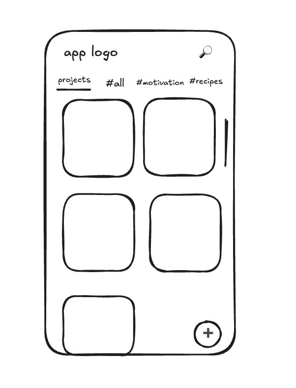
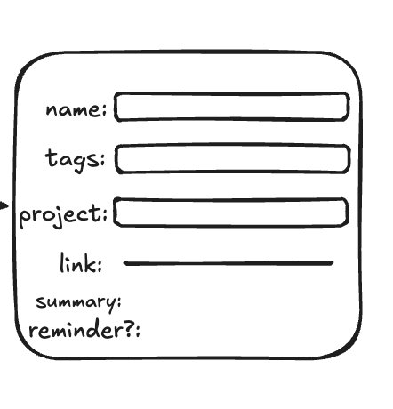
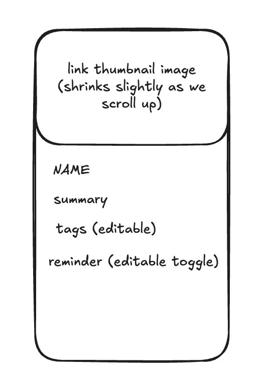
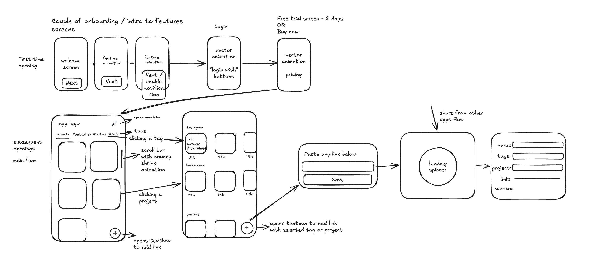
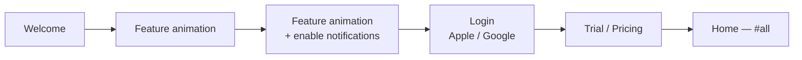
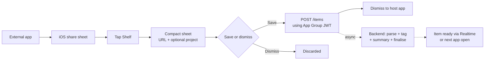
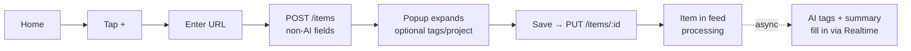
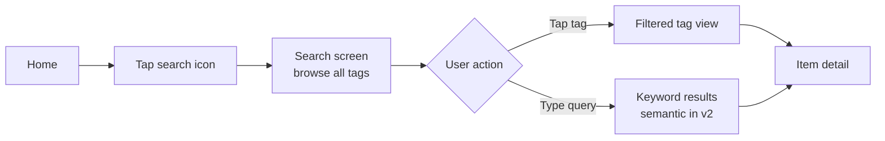

# Shelf — Product Requirements Document

> Design system (colours, typography, spacing, libraries): see [DESIGN.md](DESIGN.md).

## 1. Overview

**App name:** Shelf
**Tagline:** Save anything. Find everything.
**Platform:** iOS (v1)

### Problem

Content consumption is fragmented. YouTube Watch Later, Instagram Collections, browser bookmarks, Pinterest boards — a saved link ends up in the wrong silo or is never found again. Existing tools (Raindrop, Mymind) either lack intelligence or have poor UX. Nobody nudges you back to what you saved.

### Solution

Shelf is a unified content-saving app. Share any link from any app — Shelf parses the content, AI assigns tags automatically, and semantic search finds it even if you search with different words. A per-item reminder ensures saved content doesn't rot.

### Target user

People who actively consume content across multiple platforms and suffer from the "saved to never return" problem — learners, researchers, content creators, professionals building knowledge in a domain.

### Terminology

The saved entity is an **item**. In v1 every item is a **link** (a URL — website, YouTube, Instagram, TikTok, etc.). Images and PDFs are deferred (§5 Out) but the data model, API, and types are named generically (`item`, `/items`) so those kinds slot in without a rename. Data model, API, and code use "item"; older UI prose and screen names that say "link" refer to the link-kind item and will be renamed to "item" during the data-layer build.

---

## 2. Competitive landscape

| App | What it does well | Why it falls short |
|---|---|---|
| Raindrop.io | Share extension, link storage, cross-platform | No AI tagging, no semantic search, no reminders, dated UI |
| Mymind | AI tagging concept, clean idea | Weak semantic matching (soy ≠ soya), cluttered UI, expensive |
| Pocket / Instapaper | Read-later for articles | Articles only, no video, no AI |

### Shelf's differentiation

- Truly semantic search (embeddings, not keyword matching — soy surfaces soya)
- AI tagging from actual content (YouTube transcripts, Instagram captions, full webpage text)
- Per-item reminders to consume saved content
- Warm, spacious, breathing-room UI — the opposite of Raindrop's file-manager feel

---

## 3. Design language

### Philosophy

The app should feel like a clean desk — calm, organised, never cluttered. Every interaction should feel effortless. The user should feel relief when opening the app, not anxiety.

### Visual

- **Colours:** Warm, light palette. Off-whites, warm creams, soft warm accents. No dark/daunting surfaces.
- **Spacing:** Generous. Cards have breathing room. Nothing is cramped.
- **Typography:** Clean, readable, minimal weight variation.
- **Corners:** Consistently rounded, friendly.

### Micro-interactions

- Scroll bar on projects view shrinks with a bouncy animation at scroll extremes
- Item detail thumbnail shrinks slightly as user scrolls up (parallax)
- Create project bottom sheet slides up from bottom
- Add-link popup expands in place once the create call returns
- Tab switch: smooth horizontal slide

---

## 4. Monetisation

| | |
|---|---|
| Free trial | 5 days, full access |
| Monthly | $3.00 / month |
| Annual | $30.00 / year |
| Payment | Apple In-App Purchase (Apple takes 15–30%) |
| Auth | Apple Sign In + Google Sign In (no email/password in v1) |

---

## 5. V1 Scope

### In

- iOS share extension (save from any app)
- Manual link input (paste field inside app)
- Content parsing:
  - **Websites:** title, thumbnail, full page text (for AI tagging only), meta description
  - **YouTube:** title + thumbnail (oEmbed); description + duration via the app's webview (datacenter IP-walled — §8.4)
  - **Instagram:** caption + thumbnail (HTML scraping, accepted fragility — public posts only)
- AI auto-tagging: 10 tags per item, user can add more manually (worker outputs `name`, `summary`, `tags`, `consume_time`)
- Every item auto-assigned `#all` tag
- Project organisation (optional — items are first-class without a project)
- **Keyword search** (client-side over `name` / `tags` / `summary`)
- Per-item reminder toggle — **stored** (`reminder_enabled`); notification delivery is v2
- Top 5 tags by frequency in tab bar
- Per-user deduplication (a user can't hold the same URL twice)
- Warm, spacious UI

### Out (v2+)

| Feature | Reason deferred |
|---|---|
| Semantic search (embeddings) | v1 search is client-side keyword over `name`/`tags`/`summary`. v2 adds embedding generation, pgvector, and a `POST /search` endpoint (§8.6). |
| Embedding generation + re-embed-on-edit | No embeddings in v1 (search is keyword). The worker generates them and the edit-triggered re-embed only ship with semantic search (§8.6). `raw_content` is still stored in v1 as the future base. |
| Failure retry (`reprocess`) | v1: a `failed` item offers **Remove** (re-add manually). The reprocess endpoint + re-invoke path are v2 (§8.2, §8.7). |
| Reminder notification delivery | v1 stores the toggle only; scheduling/delivery (local or push) is v2 (§8.5). |
| Image & PDF items | URL-kind items first; images/PDFs add upload UI, file limits, PDF text extraction, image vision-for-tagging. Data model keeps a generic `type` so they slot in later. When built, files go to **Supabase Storage** (not raw S3 — stays in one platform, integrates with RLS/auth). |
| Global dedup | v1 dedups per-user only. v2: if any user already processed a URL, copy the processed result instead of re-parsing (§8.3). |
| YouTube full transcript + server-side proxy | v1 already recovers **description + duration** via the app's logged-out webview on `fetch_failed` (the residential-IP path, §8.2/§8.4) — the datacenter IP can't. What remains v2: the **full caption transcript** (vs the short description the webview reads) and a server-side proxy so a share-extension link needn't defer its fetch to next app open. |
| Non-video YouTube pages | Channels / playlists / shorts-feed parse early to nothing today; dedicated handling deferred. |
| Moti animations | Blocked: Moti has no stable Reanimated 4 support (app is on Reanimated 4 + New Arch). Revisit when the library catches up; until then animations use Reanimated 4 directly. |
| NativeWind (Tailwind styling) | Deferred — large migration that overlaps the existing `tokens.ts` design system; no functional gain. Revisit incrementally on new screens if desired. |
| Read-only link sharing | Nice, not core to the save→find→consume loop |
| Collaborative collections | Significant scope |
| Android | Validate on iOS first |
| Notes/annotations on items | Useful but not the core thesis |
| YouTube transcript in search | v1 uses transcript for tagging; full-text search excluded |

---

## 6. Screens

### 6.1 Onboarding (first-time opening)

**Flow:** Welcome → Feature animation → Feature animation + enable notifications → Login → Free trial / Buy now → Home (`#all`)

- 2–3 feature animation screens highlighting core value props
- Notification permission requested on 3rd onboarding screen
- Login screen: "Continue with Apple" (black) + "Continue with Google" (white), privacy note at bottom
- Pricing screen: 5-day free trial or Buy now — $3/month or $30/year

---

### 6.2 Home screen



**Header:**
- `☰` hamburger menu — far left, opens left sidebar drawer
- "Shelf" — centred
- `🔍` search icon + `📅` calendar icon — far right (calendar hidden on the Projects tab)

**Tab bar (below header, horizontally scrollable):**

`projects` | `#all` (default, underlined on load) | top 5 tags by frequency (scrollable). Switch tabs by tap or swipe.

**Projects tab:**
- 2-column grid of project cards
- Each card: auto-generated 2×2 thumbnail collage from first 4 item thumbnails (fallback: warm gradient + project name)
- Custom scroll bar with bouncy/shrink animation at extremes

**Tag tabs (`#all` + individual tags):**
- Items grouped by week in descending order
- Each week group: 2.5-column horizontal scroll row
- Each card: thumbnail + name + source platform icon, plus a consume-time badge (clock icon + formatted `consume_time`, e.g. "12m") overlaid on the thumbnail. The badge is **hidden when `consume_time` is blank/`null`** — never render an empty pill.
- Card reflects item `status` (§8.2): non-terminal (`started`/`fetched`/`fetch_failed`) → skeleton fill-in (non-clickable for file items until terminal), with a soft "taking a while…" hint after ~30–45s; `failed` → failure affordance (**v1: Remove**; **v2** adds **Try again** → reprocess); `ready` → normal card.

**Calendar / date filter:**
- The `📅` icon opens a calendar bottom sheet; days that have saved items are marked
- Selecting a day filters the active feed (tag or project) to that day, shown as a 2-column grid
- The icon switches to a filled accent state while a date is active; tapping it again clears the filter and restores the week-grouped feed
- Available on every tab except Projects

**FAB:** `+` bottom right — opens manual add flow

---

### 6.3 Add-link popup



The in-app **manual add** flow (`+` → enter URL). The sheet is **single-phase**: paste a URL, optionally pick a project, tap **Add** — and it dismisses immediately. It does **not** expand, wait, or edit metadata. `create-item` returns instantly (§8.7) and the new card appears in the feed at `started`, where name/thumbnail/tags stream in from the workers. The share extension does not use this popup (§6.10); file adds skip it entirely (§8.8).

**Flow:** enter URL → optionally pick project → **Add** → `POST /items` (instant insert) → sheet dismisses → card appears in the feed at `started` → enrichment streams in via Realtime.

**Fields:**

| Field | Behaviour |
|---|---|
| Link | The URL to save |
| Project | Optional, choose from existing projects (pre-selected when adding from a project) |

Name, thumbnail, summary, and tags are no longer edited here — they're AI/worker-generated and editable later on the item detail screen. This keeps the add action instant (the win for the share-and-forget path).

**Actions:** Add button + swipe down to dismiss

---

### 6.4 Item detail screen



**Header:** Large thumbnail — shrinks slightly on scroll (parallax). Tapping thumbnail opens original URL in Safari.

**Body:**
- NAME (tap to edit) — first two words in `accent`, rest in `primary` (same client-side rule as the card)
- Source platform icon (Instagram / YouTube / Website) + domain
- Consume-time line below the source (clock icon + time, accent colour) — start-aligned with the source row and matching its text size; hidden when `consume_time` is blank
- Summary (immutable)
- Tags (editable)
- Reminder toggle (editable)

**Footer:**
- Persistent "Open" button — opens original URL
- Delete button below Open

---

### 6.5 Search screen

**Empty state (no query):**
- Search bar at top (auto-focused)
- "Browse by tag" label
- All tags as flowing wrap of pill chips — tap to filter. Doubles as the tag browser for tags not surfaced in the top-5 tab bar.

**Results state (query typed):**
- **v1: client-side keyword match** over `name` / `tags` / `summary` of the already-loaded items (no backend call).
- **v2: semantic results** (embeddings — soy surfaces soya) via `POST /search` (§8.6).
- Same card format as main feed (thumbnail + name + source icon + tags)
- Results update as user types (debounced)

---

### 6.6 Create project

Tap `+` on home → bottom sheet slides up:
- Drag handle at top
- "New project" label
- Single text input (auto-focused, keyboard appears) — **20 character limit**
- "Create" button (disabled until name is entered)

Project name is stored and displayed in title case (e.g. "app launch ideas" → "App Launch Ideas").

Project thumbnail auto-generates as items are added (2×2 collage of first 4 item thumbnails, fallback warm gradient + name).

---

### 6.7 Settings (sidebar drawer)

Triggered by `☰` — slides in from left.

**Sections:**
- Account (profile photo, name, email)
- Subscription (current plan, manage via Apple IAP)
- Notifications (global toggle)
- About (version, privacy policy, terms of service)

---

### 6.8 Empty states

**Home (`#all`, no items saved):**
Bookmark icon in a circle + "Nothing saved yet" + "Share any link to Shelf from any app, or tap + to add one manually."

**Empty project:**
"No items in this project yet." + add item button.

---

### 6.9 Project detail

Triggered by tapping a project card from the Projects tab.

**Header:**
- `←` back arrow — far left
- Project name — centred (replaces "Shelf" logo), displayed in title case
- Font size shrinks to fit on a single line for longer names (max 20 chars)
- `✏️` pencil icon + `📅` calendar icon — far right

**Tab bar:** Same horizontal scroll tag bar as home. Tapping a tag navigates to the global tag view for that tag (not filtered within the project).

**Body:**
- Items in this project grouped by week in descending order
- Same 2.5-column horizontal scroll rows as the tag feed
- Same card format: thumbnail + consume-time badge (hidden when blank) + title (`name`, first two words in `accent`, rest in `primary` — client-side rule)

**FAB:** `+` bottom right — opens manual add flow with this project pre-selected.

**Edit / delete (pencil icon):**
Opens a bottom sheet (same pattern as create project):
- Drag handle at top
- "Edit project" label
- Rename text input (pre-filled with current name)
- "Save" button
- Red "Delete project" option below Save → confirmation asks **whether to also delete the items** in the project, or keep them (they become project-less). The choice maps to the `delete_items` flag on `DELETE /projects/:id` (§8.7).

**Empty state:** "No items in this project yet." + add item prompt.

---

### 6.10 Share extension sheet

The iOS share extension is how items enter Shelf from other apps (Safari, TikTok, Instagram, YouTube, etc.). It runs in a **separate sandboxed process** from the main app and stays in-place over the host app — it never launches the main app (Pattern A). (Exception: the `handover` transport for free-account on-device builds, which opens the app to save — see §8.10.)

**Behaviour:**
- User taps Shelf in the iOS share sheet → compact sheet appears over the host app
- Shows the shared URL (read-only) and an **optional project picker** (autocomplete from existing projects)
- **Save** button → fires the item to the backend, then dismisses back to the host app
- The extension does **not** parse content, generate tags, or wait for AI — it only hands the URL to the backend. All processing happens on the backend after dismissal.

**What "Save" does:**
1. Reads the user's JWT from the shared **App Group** container (written there by the main app on login)
2. POSTs the URL (+ optional `project_id`) to the backend `POST /items` endpoint
3. Dismisses immediately (~200ms; no AI wait)
4. Backend asynchronously parses content, runs AI tagging/summary, and advances the item to a terminal status (embedding in v2)
5. The item appears in the main app via Realtime (if open) or its next fetch

**Not-signed-in edge case:** If the App Group has no JWT (user shared a link before ever signing in), the sheet shows "Open Shelf to sign in first" instead of the save UI.

**Shared files (v2, deferred):** a shared image/PDF runs the file path — validate size/type → `POST /items` with a file body → upload to the returned `upload_url` (§8.8), same as the in-app file add minus the picker.

**Fields:**

| Field | Behaviour |
|---|---|
| Link | Immutable, shown read-only |
| Project | Optional, autocomplete from existing projects |

**Actions:** Save button + swipe down to dismiss (discards). See §8.5 for the architecture.

---

## 7. User flows



### 7.1 First-time opening



---

### 7.2 Share from external app

The extension stays in-place over the host app and hands the item to the backend, which processes it asynchronously.



---

### 7.3 Manual add



---

### 7.4 Search



---

## 8. Technical decisions

> Tech stack & infrastructure: see §8.9. In short — Supabase (Postgres + pgvector + Realtime + Storage + Auth), direct client + RLS for plain CRUD, and **Supabase Edge Functions (Deno/TS)** for the create endpoint and the worker. (v1 runtime decision, 2026-06-13: Edge, not Python/Lambda — see §8.9.)

### 8.1 Data model

**Items** (key fields):

| Field | Mutable | Notes |
|---|---|---|
| `id` | No | Server-assigned on create; returned immediately |
| `user_id` | No | Owner; scopes RLS and the dedup constraint |
| `type` | No | `link` in v1; `image` / `pdf` reserved (deferred) |
| `url` | No | The shared URL (link-kind items) — original, as received |
| `normalized_url` | No | Canonicalised `url` used as the dedup key; `unique (user_id, normalized_url)` |
| `status` | Derived | Staged lifecycle (§8.2). `awaiting_upload` (file uploads, v2) / `started` / `fetched` / `fetch_failed` / `ready` / `failed` |
| `status_changed_at` | Derived | Timestamp the row entered its current `status`; drives the watchdog's time-in-state deadlines (§8.2). Maintained by a trigger on every status change |
| `dispatched_at` | Derived | Paced-dispatch claim marker (§8.2): set when a drainer dispatches the worker for the row's current stage, nulled on any status change. Orthogonal to `status` |
| `app_fetch_attempts` | Derived | Count of client-assisted fetch attempts (§8.2); incremented by the app on pickup (claim-then-work), count-gated to `failed` by the watchdog |
| `raw_content` | No | Immutable base for all embedding generations; populated during processing. Kept user-agnostic for future global dedup (§8.3) |
| `name` | Yes | Pre-filled from the parsed `title` (non-AI, in the create response); user editable |
| `tags` | Yes | 10 AI-generated (async, by the worker); user can also add their own (in the add-link popup or later) |
| `summary` | No | AI-generated |
| `thumbnail_url` | No | From OG/Twitter tags or oEmbed; may arrive in the fast create response |
| `consume_time` | No | Estimated time to consume, in **seconds** (read / watch / listen). Derived during processing (§8.4). `null` when not applicable or unknown; UI hides the badge when blank |
| `embedding` | Derived (**v2**) | `raw_content + current name + current tags` → one vector. Not generated in v1 (search is client-side keyword, §8.6) |
| `project_id` | Yes | Optional; FK → `projects.id`. On project delete, either the items are deleted or `project_id` is set null, per the `delete_items` flag (§8.7) |
| `reminder_enabled` | Yes | Push notification toggle |
| `source` | No | The link's **real normalized host** (e.g. `youtube.com`, `nytimes.com`), via `tldts`. Not a fixed bucket — an unrecognized host keeps its true identity. YouTube/Instagram get dedicated parsers; everything else uses the website parser (§8.4) |
| `created_at` | No | Save timestamp; drives the week-grouped feed |

**Projects:**

| Field | Mutable | Notes |
|---|---|---|
| `id` | No | Server-assigned |
| `user_id` | No | Owner; scopes RLS |
| `name` | Yes | Stored + displayed title-cased, ≤ 20 chars (§6.6) |
| `created_at` | No | Creation timestamp |

`linkCount` is **not stored** — project membership (and the 2×2 collage) is derived client-side from the item list.

Every item auto-gets the `#all` tag. Tag filtering, top-5 tag computation, and project membership are all derived client-side from the full item list (§8.6).

### 8.2 Processing & sync model

Items are created optimistically and enriched asynchronously through a **staged pipeline**. The user never waits for AI, and the backend owns every status transition.

**Create (fast path, sub-100ms DB op):**
- `POST /items` with the URL normalizes → dedups → inserts the row at `status: 'started'` → returns it. It makes **no network calls**: `source` is a best-effort guess from the normalized host; title, thumbnail, content, and AI all arrive later from the workers. This keeps the create response (and the share sheet) instant.
- **Manual add** (in-app `+`): the create response enters the feed at `started` (single-phase sheet, §6.3). **Share / file**: same, no popup. All enrichment streams in via Realtime.

**Staged lifecycle (the "complete" mechanism).** Fetching is split from AI processing, with a client-assisted middle step for content the datacenter IP can't reach (the YouTube / Instagram / Reddit IP-wall, §8.4):

| State | Meaning | Exits via |
|---|---|---|
| `awaiting_upload` | file uploads only (v2): row created, presigned URL issued, file not yet stored | storage event |
| `started` | created, awaiting backend fetch | `fetch-item` |
| `fetched` | a usable body (`raw_content`) was obtained — either by the backend or by the app's residential-IP webview | `enrich-item` |
| `fetch_failed` | backend fetch blocked (no body); awaiting the app's residential-IP fetch | app |
| `ready` | AI processing done — terminal success | — |
| `failed` | terminal failure — nothing usable produced | — |

Residential-fetch provenance is now encoded in `app_fetch_attempts` (> 0 means the app supplied the body), not a distinct status.

- **Fetch criterion:** a row reaches `fetched` only if the backend got a usable **body** (`raw_content`); otherwise `fetch_failed`, even when a title/thumbnail were obtained (e.g. YouTube oEmbed yields title + thumbnail but no description). Whatever title/thumbnail/source the backend *did* get is persisted, so the app augments rather than starts blank.
- "Complete" = any **terminal** state (`ready` / `failed`). The client stops watching a row once terminal.
- **No `partial` state.** Enrichment degrades gracefully to `ready`; `failed` is reserved for "nothing usable was produced."

**Functions & transitions (one writer class each, every write a guarded CAS).** `create-item` inserts at `started`; `fetch-item` fetches the body only (no Gemini); `enrich-item` runs one grounded Gemini call; the **app** handles the client-assisted fetch:

| From | To | Writer | Guard |
|---|---|---|---|
| `started` | `fetched` / `fetch_failed` | `fetch-item` | `WHERE status='started'` |
| `fetch_failed` | `fetched` | app | claim `WHERE status='fetch_failed' AND dispatched_at IS NULL AND app_fetch_attempts < N` (set-if-null); write `WHERE status='fetch_failed'` |
| `fetch_failed` | `failed` | watchdog | `WHERE status='fetch_failed' AND app_fetch_attempts >= N` |
| `fetched` | `ready` | `enrich-item` | `WHERE status = 'fetched'` |

Each transition writes its **status and content in one `UPDATE`** (never status first, content second), so the enrich dispatch never sees a row whose content hasn't landed. The app **never** writes `failed` — it only fetches and writes `fetched`; finalizing an exhausted row is the watchdog's job. No fencing token is needed: one writer class per state, guarded CAS terminal writes, idempotent side-effects.

**Paced dispatch (no immediate-fire triggers).** Worker invocation is **rate-controlled**, not fired synchronously from the row write. The `items` table *is* the queue, partitioned by `status`: `started` = the fetch queue, `fetched` = the enrich queue. Two **pg_cron drainers** (one per stage, every 5s, each with its own concurrency cap `K`) pull from the table and dispatch — per tick:
1. count `in_flight` = rows in the stage with `dispatched_at` set;
2. if `in_flight ≥ K`, wait for the next tick;
3. else claim up to `K − in_flight` undispatched rows (`… WHERE status=<stage> AND dispatched_at IS NULL ORDER BY created_at FOR UPDATE SKIP LOCKED`), set `dispatched_at = now()`, and fire `pg_net` to the worker for each.

`dispatched_at` is orthogonal to `status` (set on claim, nulled on any status change), so a slot frees automatically as the row advances. `SKIP LOCKED` makes overlapping ticks safe (no double-dispatch, no blocking). Surplus beyond `K` **waits durably** in-state instead of being dropped at the Edge concurrency ceiling — throughput degrades gracefully (queue and wait) under burst rather than failing (drop). `K` is per-stage and independent (fetch is I/O-bound, tolerates a higher `K`; enrich is bounded by the Gemini rate limit); at single-user volume `K=1` (serial per stage). A cheap hourly pg_cron job prunes `cron.job_run_details` so the two 5s drainers don't grow the cron log unbounded.

**Live updates — Supabase Realtime:**
- The app subscribes to `items where user_id = me`, watches non-terminal rows for fill-in, and picks up `fetch_failed` rows to drive the client-assisted fetch.
- When a worker `UPDATE`s a row, the change is pushed over the websocket and the UI fills in. No polling — Realtime is the only live-update mechanism.

**Fetch / reconcile triggers (the safety net):**
- Full `GET /items` + `GET /projects` (parallel) on **session acquired**, on **foreground after background**, on **network reconnect**, and on **Realtime re-subscribe** (websocket drop→resume). This catches anything that completed while the app was closed/offline or while the subscription was briefly down — including **missed `fetch_failed` pushes** — covering the gap a polling fallback would otherwise fill.
- No background work when the app isn't foregrounded; the next reconcile fetch catches up.
- Data fetching is **gated on session** and re-run on logout→login.

**Watchdog — the backend owns failure, never the client.** The client only *reflects* a backend status; it never declares failure on a timer (that would split-brain a backend that succeeds late). A **pg_cron** sweep (every minute) enforces per-state deadlines — time-gated rules measure **time-in-state** via `status_changed_at`; the `fetch_failed` count-gate has no time component (so an offline app's rows can wait indefinitely); the **client-claim lease** is time-gated on `dispatched_at`:

| State | Sweep rule |
|---|---|
| `started` | past the fetch deadline (90s) → `fetch_failed` (hand to the app; covers a dropped dispatch / hung fetcher — escalation, not a retry) |
| `fetched` | past the Gemini deadline (90s) → `failed` (content discarded; **no worker retry in v1**) |
| `fetch_failed` (claimed) | `dispatched_at` older than the **lease** (45s, > the client fetch timeout) → null `dispatched_at` (release the stale client claim so the app re-claims; the realtime push drives the retry) |
| `fetch_failed` | `app_fetch_attempts >= N` → `failed` (the dead-letter step; only finalizes rows the app has exhausted) |
| `awaiting_upload` | past 3 min → `failed` (abandoned upload, v2) |

The watchdog is the **only** recovery for a dropped/crashed claim (there is no separate visibility timeout): a dropped *backend* dispatch leaves `dispatched_at` set with `status` unchanged and ages out via its per-state rule; a failed/crashed *client* fetch leaves the client claim set and is released by the lease rule above — the same `dispatched_at` mechanism on both sides. Deadlines sit **above each stage's P99** — splitting fetch from Gemini lets each take a tighter deadline than the old single-stage 120s. (If pgmq is added later, its visibility-timeout/DLQ can take over this role — §8.9.)

**Client-assisted fetch — claim via `dispatched_at` (the attempt cap).** `dispatched_at` is the **single claim marker for the client stage too** — the same one the backend drainers use. On a `fetch_failed` row the app fetches the body on its residential IP via a hidden, **logged-out** `WKWebView` (per-source recipes in §8.4):
- the app selects `fetch_failed` rows `WHERE app_fetch_attempts < N`;
- it **claims** with one atomic `UPDATE … SET dispatched_at = now(), app_fetch_attempts = app_fetch_attempts + 1 WHERE status='fetch_failed' AND dispatched_at IS NULL AND app_fetch_attempts < N`. The **set-if-null gate is the exclusion** — a second pickup (provider remount, reordered realtime, duplicate effect) updates zero rows, so the fetch *and* the increment happen exactly once. The increment lands with the claim, so a crash mid-fetch still advances the count;
- success → `fetched` + content in a single `UPDATE … WHERE status='fetch_failed'`; the status change **auto-nulls `dispatched_at`** (trigger), freeing the row for the enrich drainer;
- a failed/crashed attempt **leaves the claim in place**; the watchdog releases it after the lease (above), re-exposing it via realtime for the next attempt;
- once `app_fetch_attempts >= N`, the count-gated watchdog finalizes the row `failed`. Total client attempts are bounded at `N` (same shape as SQS `maxReceiveCount` → DLQ).

There is **no in-memory dedup guard and no client retry interval**: exclusion is the DB claim, retry pacing is the watchdog lease (delivered via realtime), and the reconcile GET is the missed-event backstop. This replaced an earlier read-modify-write CAS on `app_fetch_attempts` that left the row in `fetch_failed` for the whole fetch, letting a second trigger re-claim mid-fetch and double the count.

The worker writes **AI-owned fields only** (`name`/`summary` when unset, and **unions** AI tags with any user tags; `embedding` is v2) — never clobbering user edits, so the manual-add Save `PUT` and the worker's write don't race destructively.

- **`DELETE` is blocked on every non-terminal state** — removes the delete-vs-late-success race; an item is deletable only once terminal (`ready`/`failed`). **File items are additionally non-interactive** (skeleton, not clickable/openable) until terminal. The manual-add Save `PUT` is the creation completing and is allowed.
- **Retry (`POST /items/:id/reprocess`) is v2** (§8.7) — a dedicated endpoint (guarded `failed → started`, resets the clock), not create (which mints a new id and would duplicate), capped (default 2, tunable). **v1:** a failed URL item offers **Remove** only — the client-assisted path is the in-band recovery for a blocked fetch.

**Client states on a card / detail:**
- `started` / `fetched`: skeleton fill-in for the not-yet-arrived fields; a soft "taking a while…" hint after ~30–45s (cosmetic only — never a failure verdict or destructive action).
- `fetch_failed`: the app's webview fetch runs (claim-then-work); to the user it still reads as in-progress.
- `ready`: normal item.
- `failed`: a failure affordance — **v1: Remove**; **v2** adds **Try again** (calls reprocess, up to the cap) before Remove.

**Open / hardening (tracked, not blocking v1):**
- **Securing the app's direct DB writes.** The app must write `raw_content` (it's the fetch source), so the write can't be blocked outright. A `SECURITY DEFINER` RPC should constrain it — permit only `fetch_failed → fetched`, restrict writable columns to `raw_content`/`status`/`app_fetch_attempts`, and **bound `raw_content` size** to cap Gemini cost. RLS scopes abuse to the user's own rows for now; prioritise when paid tiers land or Gemini spend needs protecting.
- **Watchdog vs. in-flight final attempt (race).** Claim-then-work makes a row count-gate-eligible at the *start* of its Nth attempt, so a sweep landing mid-fetch can finalize a still-fetchable row (last attempt only). Accept (rare; user re-adds) or add a `last_app_attempt_at` staleness gate to the finalize.
- **`dispatched_at` slot leak vs. `in_flight` precision.** A dropped invocation holds a slot until the watchdog ages the row out, under-utilising `K`. Add a short dispatch lease only if this throttling proves real (it's a visibility timeout by another name, deliberately excluded).
- **Tuning:** the client attempt cap `N`, the per-state deadlines, and `K` per stage.
- **Expiring thumbnails:** CDN-signed `og:image` (Reddit `preview.redd.it`, backend Instagram) 404s after hours. v1 accepts staleness; v2 rehosts to Supabase Storage at fetch time. (Client-path Instagram is already durable via the tokenless `/media/` redirect.)
- **pgmq upgrade seam:** swap table-as-queue for pgmq if true multi-consumer, replay, or queue-depth metrics are ever needed (§8.9).

### 8.3 Deduplication

**v1 — per-user dedup.** A user can't hold the same URL twice.

- **Match key:** `normalized_url`, enforced by `unique (user_id, normalized_url)`.
- **Normalisation (conservative):** lowercase scheme + host, strip default port, drop the URL fragment, remove trailing slash, strip well-known tracking params (`utm_*`, `fbclid`, `gclid`, `igshid`, `si`, …), and sort the remaining query params. **Meaningful params are kept** (e.g. YouTube `?v=`, article `?id=`) — under-normalising (a missed dup) is safer than over-normalising (merging distinct content).
- **On collision, `POST /items` is idempotent** — it returns the existing item (not an error), so callers don't special-case it:
  - **Manual add:** surface the existing item (navigate / highlight) with an "Already in your shelf" toast. If a project was chosen and the item has **no** project, file it into that project; if it already has a different project, leave it and just surface (no silent move).
  - **Share extension:** fire-and-dismiss as usual; the returned existing id is a no-op save, sheet shows "Already saved ✓" (same project-if-empty rule).

**v2 — global dedup (deferred).** If *any* user has already processed a URL, copy the processed result instead of re-parsing/re-tagging.

- Only the **user-agnostic, immutable** artifacts are shareable: `raw_content`, `thumbnail_url`, source title, `summary`, and the initial AI tags / initial `embedding`. Per-user mutable state (`name`, edited `tags`, `project_id`, `reminder_enabled`) is never copied.
- Implies a global, normalized-URL-keyed processed-content store separate from per-user items. v1 keeps `raw_content` / `summary` user-agnostic so this is a clean addition later.

### 8.4 Content parsing

Parsing lives in a small **OOP module** (`_shared/parsers/`): a `Parser` interface with `fetchContent(url)`, one class per platform (`WebsiteParser`, `YoutubeParser`, `InstagramParser`, `RedditParser`), and a `getParser(source)` factory. It runs in the fetch stage (`fetch-item`), never in `create-item` (§8.7). Fetching is **two-tier**: the backend tries first; when the datacenter IP can't reach the body, the row goes `fetch_failed` and the **app** re-fetches it on its residential IP via a hidden webview (§8.2). Whatever the backend got (title/thumbnail/source) is kept either way.

| Source | Backend (`fetch-item`) | Notes |
|---|---|---|
| YouTube | **oEmbed** → title + thumbnail only (no body) → `fetch_failed` | Description + duration are **IP-walled** from the datacenter egress (confirmed across oEmbed, youtubei.js, youtube-transcript, yt-dlp). The app's webview recovers them (below) — v1 ships this, not the v2-deferred proxy. |
| Instagram | **Private web GraphQL** → caption + thumbnail (best-effort) | URL classified (post / reel / story / profile / feed / other); caption fetched only for posts & reels. Often IP-walled → `fetch_failed` → client recipe. ToS risk accepted; public only; undocumented `doc_id` (maintenance liability). |
| Reddit | **OG tags** from the SSR HTML | The `.json` view returns the SPA shell without a session (logged-out); OG meta only. Often IP-walled → client recipe. |
| Websites | **Full page text** (OG meta + body text) → `fetched` | Cleanly-scraped sites get a body server-side. Full text → AI for tagging; search operates on tags + title only (not raw page text). |

URL handling uses standard libraries — `normalize-url` (canonicalize, add scheme, strip tracking params for the dedup key) and `tldts` (robust host extraction, handles scheme-less / messy input where `new URL()` throws).

**Client extraction — hidden webview, per source (verified).** When a row is `fetch_failed`, the app fetches via a hidden `WKWebView` (`react-native-webview`) on its residential IP. iOS sandboxes the webview's cookie store per app, so it is a **logged-out** context — every recipe must work signed-out:
- **YouTube** (full): read `window.ytInitialPlayerResponse.videoDetails` → `title`, `shortDescription` → `raw_content`, `lengthSeconds` → `consume_time`, `author`, highest-res thumbnail. The description + duration the backend oEmbed can't get.
- **Instagram** (caption + author; verified logged-out, HTTP 200): `og:title` → title/author, `og:description` → caption (strip the `"N likes, M comments - user on date:"` prefix). **Thumbnail = the `instagram.com/p/<shortcode>/media/?size=l` redirect** built from the URL's shortcode (tokenless, 302s to a fresh image each load) — *not* `og:image`, whose signed CDN token expires in hours. Loads via native `<Image>` (no CORS).
- **Reddit** (og tags only): the logged-out webview gets the SSR HTML → `og:title`/`og:description`/`og:image`. Reddit's `.json` needs a session and was dropped.
- **Website** (default): `document.title` / og tags + boilerplate-stripped `body.innerText`.

**`consume_time` derivation:**
- **Websites / articles:** estimate from `raw_content` word count at ~225 wpm → seconds.
- **YouTube:** `lengthSeconds` from the client webview's `videoDetails` (the backend IP can't get it); `null` only if the client fetch never lands.
- **Instagram:** reel/video duration when present, else `null` (no natural duration; badge hidden).
- **Images / PDFs (deferred):** images `null`; PDFs may estimate from extracted text word count.

### 8.5 AI tagging & share extension architecture

**AI tagging:**
- One **Gemini 2.5 Flash-Lite** call per saved item, run by **`enrich-item`** → `name`, `summary`, `tags` (a single structured-output call). `consume_time` is derived non-AI (§8.4). Dirt cheap — fractions of a cent per item. (Embedding generation is **v2**, OpenAI `text-embedding-3-small` — §8.6.)
- **Always async** across every entry point (manual add, share, file). `enrich-item` generates the fields once the body is in (`fetched`, §8.2); they stream into the item via Realtime. The user adds their own tags later on the item detail screen (§6.4); the AI tags **union** in when ready, never clobbering user tags.

**Reminders:** v1 stores the per-item `reminder_enabled` toggle only. Scheduling and delivery (local notification vs server push) are **v2** — nothing fires a notification in v1.

**Share extension architecture:**
- The extension is a separate process and cannot access the main app's Supabase session directly.
- **App Group** shared container bridges them: the main app writes the user's JWT (access + refresh token) to the App Group on login and on token refresh; the extension reads it when it needs to make an authenticated call.
- On Save, the extension POSTs `{ url, project_id? }` to `POST /items` using the App Group JWT, then dismisses (~200ms, no AI wait).
- The backend runs a share-created item through the staged pipeline (§8.2): `fetch-item` (or the app's client-assisted fetch on `fetch_failed`) → `enrich-item` AI `name`/`tags`/`summary` → `ready` (embedding in v2). The main app picks it up via Realtime (if open) or its next `GET /items`.
- If the App Group has no JWT (link shared before first sign-in), the extension shows a "Open Shelf to sign in first" message rather than the save UI.
- The main app auto-refreshes its access token (`autoRefreshToken`) and writes the latest tokens to the App Group. But the extension is a separate process without that refresh loop, and access tokens last ~1h — so if the access token from the App Group is expired, the extension **refreshes it itself using the stored refresh token** before calling `POST /items`, rather than failing.

### 8.6 Search

**v1 — keyword (client-side).** Search runs entirely on the device over the already-loaded items: case-insensitive substring/keyword match against `name`, `tags`, and `summary`. No backend call, no endpoint, no embeddings. (This is the current frontend behaviour — promote it from stand-in to the v1 mechanism.)

**v2 — semantic (deferred).** The differentiator (soy surfaces soya):

- **Embeddings:** OpenAI `text-embedding-3-small` → pgvector on Supabase; HNSW index for sub-50ms queries.
- **What gets embedded:** `raw_content + current name + current tags` per item. The worker generates it; `raw_content` (already stored in v1) is the immutable base, so v2 needs no re-fetch.
- **Search endpoint:** `POST /search { query }` (Lambda) — embeds the query (OpenAI key is server-side only), runs the pgvector similarity query, returns items.
- **Re-embed on edit:** async — a name/tag edit fires a Postgres trigger → pg_net → the worker in `reembed` mode (regenerates only the embedding), guarded so the worker's own write doesn't self-trigger. Brief, harmless search staleness.
- **Website search scope:** tags + title only, not raw page text.

`raw_content` is stored immutably in **v1** even though nothing reads it yet, so v2 embeddings (and global dedup, §8.3) drop in without re-fetching.

### 8.7 API surface

Most of the surface is **not** a hand-written endpoint — the app calls Supabase directly and **RLS** (`user_id = auth.uid()`) enforces ownership. In **v1 the only app-facing backend function is `POST /items`** (create-item, an Edge function); the `fetch-item` and `enrich-item` workers are system-invoked by the paced drainers (§8.2), never called by the app. `reprocess` and `POST /search` are v2 (§8.9).

| Method | Endpoint | Where | Purpose |
|---|---|---|---|
| GET | `/items` | Direct + RLS | Load all items (full rows) |
| GET | `/projects` | Direct + RLS | Load all projects on open (catches empty projects) |
| POST | `/items` | **Edge fn** | **Create** — body branches on kind. **Link:** `{ url, project_id? }` → **normalize → dedup → insert at `started` → return**, a sub-100ms DB-only op with **no network calls** (`source` is a best-effort from the normalized host). All enrichment — title, thumbnail, resolved source, content, AI — is the **workers'** job (`fetch-item` then `enrich-item`), picked up from the queue by the paced drainers (§8.2); this keeps the create response (and the share sheet) instant. Idempotent on `normalized_url` collision (§8.3). **File (v2):** `{ type, filetype, size, project_id? }` (app pre-validates) → row at `awaiting_upload`, returns `{ id, upload_url }` (presigned PUT, 3-min TTL, type/size-constrained, id in object key). See §8.8 |
| PUT | `/items/:id` | Direct + RLS | **Update** — manual-add Save (user tags / project / name) and later edits. A name/tag change fires the async re-embed trigger (§8.6) |
| POST | `/items/:id/reprocess` | **Lambda (v2)** | **Retry** a `failed` item (§8.2). Guarded `failed → started`, resets `status_changed_at`, re-enters the pipeline. Artifact present (file in storage / link URL) → just re-enter; a file upload that never landed → returns a fresh `{ upload_url }` and sets `awaiting_upload` so the app re-uploads. **v1 has no retry** (failed → Remove) |
| POST | `/search` | **Lambda (v2)** | Semantic search — embeds the query, pgvector similarity, returns items (§8.6). **v1 search is client-side keyword, no endpoint** |
| POST | `/projects` | Direct + RLS | Upsert project — create (no id) or update (id present) |
| DELETE | `/items/:id` | Direct + RLS | Delete an item (rejected on any non-terminal state — untouchable until terminal `ready`/`failed`, §8.2) |
| DELETE | `/projects/:id` | Direct + RLS | Delete a project. Body `{ delete_items: bool }` — `true` deletes the project's items; `false` orphans them (`project_id → null`). The app prompts the user to choose (§6.9) |

Synchronous failures of `POST /items` (create) and of the direct upload PUT are surfaced to the user as a **"try again"** error before any item is committed to the feed.

**Frontend data strategy:**
- Both GET endpoints fire in parallel on session-acquired and on foreground (§8.2)
- All items loaded in full (no partial fields) — ~150KB at 100 items, trivially small
- Tag filtering, top-5 tag computation, and project membership all derived client-side
- Live fill-in of in-flight items via Supabase Realtime; reconcile GETs are the safety net (no polling)
- No pagination in v1; add cursor-based pagination if per-user item count grows past ~500

### 8.8 Item ingestion — end-to-end flow

Both kinds of item — URL (v1) and file (v2, deferred) — share one staged pipeline and the §8.2 lifecycle (optimistic create at `started` → fetch → enrich → terminal, with Realtime fill-in, the per-state watchdog, paced dispatch, and v2 reprocess). They differ only in how the content reaches the backend.

**Dispatch is paced and decoupled from any single source (§8.2).** Work is **not** fired synchronously from the row write. The `items` table is the queue, partitioned by `status`, and two pg_cron drainers dispatch the stage workers (`fetch-item` for `started`, `enrich-item` for `fetched`) via **pg_net** at a bounded rate. The workers are source-agnostic and read whatever the row points at (the URL for links; the storage object for files in v2). This is what lets retry re-enter the pipeline without a re-upload. (No queue table in v1 — see §8.9 for the table-as-queue vs pgmq trade-off and upgrade path.)

**URL item — in-app manual add (v1):**
1. App `POST /items { url, project_id? }`. Backend normalizes → dedups (§8.3) → inserts the row at `started` (best-effort `source`, **no network**) → returns it. Create error → "try again" (nothing enters the feed).
2. The single-phase add-link sheet (§6.3) dismisses immediately; the card appears in the feed at `started` (everything in skeleton). No `PUT` — name/tags/etc. are edited later on the detail screen.
3. `fetch-item` (dispatched by the fetch drainer): parse content → write `fetched` + `raw_content`, or `fetch_failed` if the body is IP-walled (handing it to the app's client-assisted fetch, §8.2).
4. `enrich-item` (dispatched by the enrich drainer once `fetched`): one grounded Gemini call → AI `name`/`tags`/`summary` → guarded terminal write to `ready` (or `failed`). (Embedding is added here in v2 — §8.6.)
5. Realtime pushes each transition; the app fills in (or runs the webview fetch on `fetch_failed`, or shows the failure affordance). Foreground/reconnect GET is the safety net.

**URL item — share extension (v1):** same backend path, but the extension `POST /items` after the optional-project step and dismisses — no popup, no `PUT`; the item enters the feed and fills in via Realtime / next fetch (§6.10).

**File item (v2, deferred):** files go to **Supabase Storage** (S3-backed, S3-compatible). Same for the in-app picker and a share-sheet file (the share just skips the picker).
1. App pre-validates size + type, then `POST /items { type, filetype, size, project_id? }`. Backend creates the row at `awaiting_upload` and returns `{ id, upload_url }` — presigned PUT, 3-min TTL, type/size-constrained, id encoded in the **object key** (`uploads/{user_id}/{item_id}.{ext}`) so the storage event carries id + owner (no metadata reliance).
2. App shows the item in the feed **immediately under a skeleton overlay**, every attribute in skeleton state. **Not clickable / won't open until `ready`.** Images: local file URI behind the skeleton (optimistic thumbnail); PDFs: document placeholder until the worker renders a first-page preview.
3. App uploads directly to `upload_url`. Upload error → "try again".
4. The `storage.objects` insert advances the row to `started` (carrying the id from the key); the paced fetch drainer then dispatches `fetch-item`, which reads the stored object (§8.2).
5. `fetch-item` → `enrich-item` as above → `ready` / `failed`; Realtime fills in or shows failure.

**Retry (both kinds) — `POST /items/:id/reprocess`** — **v2** (§8.2, §8.7). When built:
- Artifact present (file in storage / link URL): guarded `failed → started`, reset `status_changed_at`, re-enter the pipeline. No re-upload.
- File upload never landed: endpoint returns a fresh `{ upload_url }` and sets `awaiting_upload`; the app re-uploads (→ storage event → drainer → worker).
- **v1:** a `failed` item has no retry — the user removes it and re-adds.

**Orphan handling:** presigned URL expires at 3 min; items left in `awaiting_upload` past that window are swept to `failed` (the same pg_cron sweep as the watchdog) so the feed never shows a permanent skeleton.

### 8.9 Tech stack & infrastructure

Guiding constraint: **no users yet, slow scale → no ever-running infra, on-trigger cost only, stay inside free tiers.** Everything below is scale-to-zero or part of Supabase's free tier.

| Concern | Choice | Why |
|---|---|---|
| DB, Auth, Realtime, Storage | **Supabase** (free tier) | One platform; Postgres + pgvector + Realtime + Storage + Auth. RLS is the authz layer |
| Plain CRUD (reads, edits, deletes, projects) | **Direct Supabase client + RLS** | No backend code or cost; JWT auto-attached, `user_id = auth.uid()` enforces ownership |
| Smart endpoint (`POST /items`) + worker | **Supabase Edge Functions (Deno/TS)** — *v1* | Deployable/testable now via MCP, one platform, scale-to-zero, free tier 500k invocations/mo. v1 workloads (HTML/oEmbed/caption fetch) are I/O-bound and fit Edge limits (256 MB, 2s CPU, 150s/400s wall-clock, 20 MB bundle). v1 has **one** app-facing fn — create; `reprocess` and `POST /search` are v2. **v2 migration seam:** PDF text + first-page render is CPU/mem-heavy and needs native libs Edge bans (`sharp`/`libvips`) — when built, move the worker to **Python on Lambda/container** and repoint the drainer's pg_net target (no schema/client change). The §8.9 Python rationale below now applies to that v2 worker. |
| Dispatch (queue → worker) | **pg_cron drainers → pg_net** (async HTTP) | Paced, concurrency-bounded (§8.2). The `items` table is the queue (partitioned by `status`); no separate queue or long-poll consumer. Surplus waits durably instead of being dropped at the Edge ceiling |
| Watchdog + orphan sweep + drainers | **pg_cron** | In-DB periodic jobs: per-state watchdog (fails stuck non-terminal / abandoned `awaiting_upload` rows), the two paced drainers, and the cron-log prune (§8.2) |
| Live updates (backend → app) | **Supabase Realtime** | Already chosen (§8.2); no polling |

**Auth.** The app sends the Supabase JWT on every call. Direct-CRUD relies on RLS. The Lambda endpoints verify the JWT (Supabase JWKS, `sub` = `user_id`); the worker uses the **service-role key** (bypasses RLS — it acts for the system) and scopes every write by the job's `item_id`. Service-role + Gemini (and the v2 OpenAI-embedding) keys live only in Lambda, never on the device.

**No separate queue in v1 — the table is the queue.** The `items` table partitioned by `status` *is* the work list; pg_cron drainers pace dispatch over it via pg_net (§8.2). No pgmq, no long-poll consumer (the always-on compute the stack avoids). At this scale a real queue's buffering/replay earns nothing and adds a dual-write consistency burden. Reliability is covered by the per-state pg_cron watchdog (stuck → escalate / `failed`) and, for blocked fetches, the client-assisted path; a `failed` URL item is removed and re-added in v1 (the `reprocess` retry path is v2). **Upgrade path:** when true multi-consumer, archival/replay, or queue-depth metrics are needed, swap the table-as-queue for **pgmq** — the drainer reads from pgmq instead of `… WHERE status = <stage>`, the worker is unchanged, and pgmq's visibility-timeout/DLQ can take over the watchdog role.

**No provisioned concurrency.** It is billed separately (no free-tier allowance) and is a fixed ~$5–11/mo always-on charge — exactly the ever-running cost we're avoiding, for near-zero benefit (the worker is cold-start-insensitive; only `POST /items`'s ~2s feel is affected, occasionally). Accept cold starts at this scale; if `create` latency ever hurts, reach for a slim zip package or Lambda **SnapStart** (Python) — both stay scale-to-zero — before PC.

**Worker functions** (each dispatched by its drainer with `{ item_id, mode }` in the pg_net payload):
- `fetch-item` / `mode: 'fetch'` (**v1**) — fetch the body only, no Gemini: `started → fetched` (usable body) | `fetch_failed` (IP-walled, handed to the app). §8.2/§8.4.
- `enrich-item` / `mode: 'enrich'` (**v1**) — one grounded Gemini call over the body → `name`/`summary`/`tags`: `fetched → ready`. (Embedding generation is appended here in v2 — §8.6.)
- `reembed` (**v2**) — embed-only: read `raw_content` + current `name`/`tags`, regenerate just the `embedding` column. Triggered by a user name/tag edit (§8.6), guarded so the worker's own write doesn't self-trigger. Ships with semantic search.

**Cold-start caveat:** `POST /items` does a live OG-tag fetch under a ~1.5s timeout; a Lambda cold start (~1–2s) on top could occasionally exceed the 2s feel. Tolerable solo; if needed, move only `create` to a fast-cold-start Deno edge function (one TS file) while the worker stays Python.

---

### 8.10 Share transport: App Group (ship) vs device handover (free-account builds)

**Problem.** The share extension's independent Supabase call (§8.5) depends on the **App Group** shared container. App Groups are free on the iOS **simulator** but require a **paid** Apple Developer account to provision on a **physical device** — a free "Personal Team" build that carries the App Group entitlement fails code-signing and can't even install on-device.

**Two transports, one build-time switch.** A single env var, `EXPO_PUBLIC_SHARE_TRANSPORT` (`app-group` default | `handover`), selects the transport and drives both the native entitlements and the runtime behaviour from one source of truth.

| Transport | When | Extension behaviour | App behaviour |
|---|---|---|---|
| `app-group` (**default — ships, and the simulator**) | Paid account / simulator | Reads the shared session, picks project, calls `create-item` directly, dismisses in place (§8.5). No app switch. | — |
| `handover` | Free-account on-device personal builds | No shared container → no session. Shows the URL + **"Open Shelf to save"**, which opens the host app via the `shelf://` scheme carrying the URL. | Receives the deep link; **the main app** saves it via `create-item` using its own session. |

**Why a build flag, not runtime simulator-detection.** Runtime detection (`isDevice`) can't ship correctly — the production build runs *on a device* yet must use App Groups. And the entitlement must be **absent at build time** for free-account signing to succeed; a runtime check can't remove a baked-in entitlement. The real axis is "is the App Group capability provisioned in this build," which is inherently build-time.

**Mechanics.**
- `app.config.js` reads the env var. In `handover` it drops the App Group entitlement + `AppGroup` Info.plist keys and inserts a `withoutAppGroups` config plugin that strips the App Group from **both** targets after `expo-share-extension` (which otherwise re-adds it unconditionally to app + extension).
- The same env var is inlined (`EXPO_PUBLIC_`) into both the app and extension JS bundles. `src/share/transport.ts` is the single runtime switch: the extension entry renders one of two flows, and the app mounts the handover deep-link intake only in `handover` mode.
- **Default is `app-group`**, so the simulator dev loop and the shipped build are unchanged and need zero config. Only free-account device builds set `EXPO_PUBLIC_SHARE_TRANSPORT=handover` before `expo prebuild` / `run:ios`.

**Handover trade-off.** No in-extension project picker (the extension has no session to list projects); the item lands in **no project** and the user re-files it in-app. This path exists only for on-device testing without a paid account — the shipping experience is the in-place App Group flow.

---

## 9. Decision log

Settled decisions and the reasoning behind them. Detail lives in the sections referenced; this is the quick-scan index.

### Product & monetisation
| Decision | Rationale | Ref |
|---|---|---|
| Name "Shelf", tagline "Save anything. Find everything." | — | §1 |
| iOS only for v1 | Validate on one platform before Android | §1, §5 |
| Auth: Apple + Google Sign In, no email/password | Lower friction, no credential management | §4 |
| 5-day free trial → $3/mo or $30/yr via Apple IAP | — | §4 |

### Scope
| Decision | Rationale | Ref |
|---|---|---|
| Entity noun is **item**; v1 items are all links | Images/PDFs deferred but model stays generic so they slot in without a rename | §1, §5 |
| Share extension + manual paste in v1 | Core save paths | §5, §6.10 |
| Content parsing: websites / YouTube (+ transcript) / Instagram | Covers the dominant save sources | §8.4 |
| AI auto-tagging: 10 tags/item, user can add | Cheap, high-value differentiator | §8.5 |
| AI model: **Gemini 2.5 Flash-Lite** for name/summary/tags (one structured call); OpenAI `text-embedding-3-small` for embeddings (v2) | Cheap, fast, structured output for tagging; embeddings deferred to v2 | §8.5, §8.6 |
| Projects optional; items first-class | Don't force organisation | §5, §6 |
| Every item auto-gets `#all` | Guarantees a default feed | §8.1 |
| Images/PDFs deferred → Supabase Storage when built | One platform, integrates with RLS/auth; S3-backed so the same presigned-upload flow applies; the event→worker trigger and completion push are native (vs DIY on raw S3) | §5, §8.8 |
| File upload flow: presigned PUT (3-min TTL, id in object key, type/size constrained) → storage event → worker → Realtime push; optimistic non-clickable skeleton; orphan sweep | Reuses the URL item lifecycle; instant feedback without waiting on AI; bounded abandoned-upload cleanup | §8.8 |
| Global dedup deferred to v2 | v1 dedups per-user only | §5, §8.3 |

### Navigation & screens
| Decision | Rationale | Ref |
|---|---|---|
| Default landing `#all`; tabs `projects` \| `#all` \| top-5 tags (tap or swipe) | — | §6.2 |
| Projects tab: 2-col grid, 2×2 collage cards | — | §6.2 |
| Tag/project feeds: week-grouped descending, 2.5-col horizontal rows | — | §6.2, §6.9 |
| Calendar date filter on every tab except Projects | Day grid; clears on toggle | §6.2 |
| Header: `☰` (sidebar) \| `Shelf` \| `🔍` + `📅` | — | §6.2 |
| Project detail header: `←` \| name \| `✏️` + `📅`; tag taps go to global tag view | Project-scoped search dropped — search is global | §6.9 |
| Add-link popup (manual add only): shows returned non-AI fields (source/title/consume-time), optional tags/project, Save → `PUT /items/:id`; no AI wait, AI fields stream in after | Share extension uses its own compact sheet; files skip the popup. Replaces the old "wait for AI then review pre-filled tags" overlay | §6.3 |
| Item detail: parallax thumbnail (tap→URL), name/source/summary/tags/reminder, persistent Open + Delete | — | §6.4 |
| Search: tag-pill browser empty state + debounced results (v1 client-side keyword over name/tags/summary; semantic v2); doubles as browser for non-top-5 tags | — | §6.5, §8.6 |
| Create/edit project: bottom sheet, 20-char limit, title-cased | — | §6.6, §6.9 |

### Technical
| Decision | Rationale | Ref |
|---|---|---|
| Optimistic create: `POST /items` inserts at `started` and returns immediately — a DB-only op (normalize → dedup → insert), **no network**; all enrichment (incl. non-AI fields) is async in the workers | User never waits; item shows instantly; create stays sub-100ms | §8.2 |
| Endpoints — **v1:** `POST /items` create (one endpoint, body branches link vs file) + `PUT /items/:id` update (direct+RLS). **v2:** `POST /items/:id/reprocess`, `POST /search` | One create endpoint for both kinds; create/update separated; POST (not GET) since create writes a row | §8.7 |
| Staged `status`: `awaiting_upload` (files) → `started` → `fetched`/`fetch_failed` → terminal `ready`/`failed`; no `partial` | Splits fetch from AI and routes IP-walled bodies to the client; enrichment degrades to `ready`, `failed` = nothing usable | §8.2 |
| **Client-assisted fetch:** on `fetch_failed` the app fetches the body via a hidden logged-out `WKWebView` (residential IP) → `fetched`; claim-then-work cap `N`, watchdog finalizes exhausted rows | The datacenter IP can't reach YouTube/IG/Reddit bodies; the phone can. Claim-on-pickup bounds retries even across crashes; the app never writes `failed` | §8.2, §8.4 |
| Supabase Realtime is the only live-update mechanism (no polling); reconcile GETs (incl. on Realtime re-subscribe) are the safety net | Instant fill-in without a polling loop; reconcile covers any missed push | §8.2 |
| Backend owns failure via a **per-state** watchdog (each deadline > that stage's P99; `fetch_failed` is count-gated); client never declares failure on a timer | Avoids client/backend split-brain; bounds each stage's skeleton; tighter than one global deadline | §8.2 |
| No attempt/fencing token; guarded CAS terminal writes (`WHERE status IN (<source states>)`); time-in-state via `status_changed_at` | One writer class per state + guarded CAS + idempotent side-effects make a token unnecessary; accepts a slow zombie's valid result winning | §8.2 |
| `DELETE` blocked on every non-terminal state (file items also non-interactive); worker writes AI-owned fields only and unions tags, never clobbers user edits | Removes the delete-vs-late-success race; lets the manual-add Save `PUT` coexist with the worker | §8.2 |
| Retry (`POST /items/:id/reprocess`) is **v2** — dedicated endpoint (not create), capped (default 2) then Remove. **v1:** failed → Remove + re-add | Create mints a new id (would duplicate); no destructive auto-action | §8.2, §8.7 |
| **Paced dispatch:** pg_cron drainers (one per stage) pace pg_net worker invocation over the `items`-table-as-queue; no immediate-fire triggers, no pgmq | Surplus waits durably instead of dropping at the Edge concurrency ceiling; retry re-enters without re-upload; worker stays a stateless HTTP fn | §8.2, §8.8, §8.9 |
| File upload (v2): Supabase Storage presigned PUT (3-min TTL, id in object key, type/size constrained); reprocess re-issues a URL only if the upload never landed | One platform, S3-backed; idempotent retry handling both failure stages | §8.8 |
| Optimistic, non-clickable skeleton until terminal; soft "taking a while" hint at ~30–45s; create/upload errors → "try again" | Instant feedback; comfort without a false failure verdict | §8.2, §8.8 |
| Fetch on session-acquired + foreground + network reconnect; no background polling; gate on session, re-fetch on login | Resource-cheap; safety-net reconcile across every resume path | §8.2 |
| Per-user dedup: `unique (user_id, normalized_url)`, idempotent POST, conservative normalisation | Idempotency keeps both callers simple; conservative norm avoids merging distinct content | §8.3 |
| Re-add files into a chosen project only if item has none | Never silently move an already-filed item | §8.3 |
| Semantic search is **v2**: `text-embedding-3-small` → pgvector/HNSW, `POST /search`, async re-embed-on-edit. **v1 = client-side keyword** (name/tags/summary). No embeddings generated in v1; `raw_content` still stored as the v2 base | Ship the cheap search first; embeddings are the differentiator but not v1-critical | §8.6 |
| AI worker outputs `name`/`summary`/`tags`/`consume_time` (single `name`, no AI-provided split); card + detail render `name`'s **first two words in accent**, rest primary — a client-side rule; summary on detail | DB model is final; the colour accent is pure frontend, no `descriptor` field to maintain | §8.1, §6.2, §6.4 |
| Reminder: **v1 stores the toggle** (`reminder_enabled`); scheduling/delivery (local vs push) is **v2** | Ship the field now; defer notification plumbing | §5, §8.5 |
| Project delete asks **delete items vs orphan** (`delete_items` flag on `DELETE /projects/:id`) | User decides; FK behaviour follows the flag (delete or set-null) | §6.9, §8.7 |
| Share extension self-refreshes its JWT via the App Group refresh token if the access token is stale | The extension doesn't run the main app's auto-refresh loop; the access token may be >1h old | §6.10, §8.9 |
| Share transport is a **build-time switch** (`EXPO_PUBLIC_SHARE_TRANSPORT`): `app-group` (default, ships + simulator) vs `handover` (free-account device builds open the app to save). Not runtime simulator-detection | Free Personal Teams can't sign App Group entitlements; shipping runs on-device yet needs App Groups — so the axis is build-time, and one env var drives both entitlements and runtime behaviour | §8.10 |
| Two tables (`items`, `projects`), both `user_id`-scoped (RLS); `linkCount`/membership derived client-side, not stored | Minimal schema; counts can't drift from the item list | §8.1 |
| Stack: Supabase (DB/Auth/Realtime/Storage, free tier) + direct-client/RLS for CRUD + Python on AWS Lambda for the smart endpoint(s) & worker | No-users / slow-scale: scale-to-zero, on-trigger cost, free tier; Python for the fetch/scrape/LLM ecosystem | §8.9 |
| v1 backend = **one** Lambda (`POST /items` create) + worker; everything else is direct-to-Supabase + RLS. `reprocess` and `POST /search` are v2 | Server code only where there's an outbound fetch, a secret, or a lifecycle transition; minimal surface | §8.7, §8.9 |
| Trigger → pg_net → Lambda; pg_cron watchdog; **no queue in v1** (pgmq is the documented upgrade) | A queue earns nothing at zero traffic; retry covered by in-invocation + watchdog + reprocess | §8.8, §8.9 |
| **No provisioned concurrency** — accept cold starts; SnapStart/slim-package if `create` latency hurts | PC is a fixed ~$5–11/mo always-on charge (no free tier) for near-zero benefit | §8.9 |
| Worker split into `fetch-item` (fetch body) + `enrich-item` (one Gemini call); `reembed` is v2 (embed-only) | Lets the client-assisted fetch slot between stages and gives each stage its own deadline/cap; re-embed shares enrich without re-running fetch | §8.2, §8.6, §8.9 |
| Re-embed on edit (v2) is **async** (trigger → worker), not synchronous | `PUT` is direct-to-Supabase (no server hook, no client key); a few seconds of search staleness is harmless | §8.6 |
| `source` = the link's **real normalized host** (not a fixed youtube/instagram/website bucket); backend-authoritative classifier via `tldts` | Preserves the destination's true identity; one robust classifier | §8.1, §8.4 |
| **All enrichment moved to the worker**; `create-item` is a fast DB-only op (normalize → dedup → insert → return, no network) | Instant create response → snappy share sheet (the common path); eliminates the create-then-worker double-fetch; worker owns title/thumbnail/source/content/AI | §8.7, §8.8 |
| Parsing is an **OOP module** — `Parser` interface, per-platform classes, `getParser(source)` factory | Replaces a monolithic file; adding a platform = one class + one factory line | §8.4 |
| URL handling via **`normalize-url` + `tldts`** (standard libs), not hand-rolled | Canonical dedup key + robust host from scheme-less/messy input (`new URL()` throws on those) | §8.3, §8.4 |
| Instagram via the **private web GraphQL** endpoint; classify URL kind, caption only for posts/reels | Full caption (OG meta is truncated/login-gated); avoids fetching captions for stories/profiles | §8.4 |
| Worker feeds Gemini only **non-empty signals** (URL always; title/content when present) with a **grounding prompt** | Prevents hallucination when title/content are absent — a generic URL-based summary beats an invented one | §8.5 |
| `raw_content` immutable, user-agnostic, embedding base | Stable base; enables future global dedup | §8.1, §8.6 |
| `consume_time` as integer seconds, formatted client-side, badge hidden when blank | Media-agnostic (read/watch/listen); sortable/locale-flexible vs a pre-formatted string; no empty pills | §8.1, §8.4, §6.2 |
| Instagram scraping: ToS risk accepted, public posts only | Known maintenance liability | §8.4 |
| YouTube: backend **oEmbed** (title + thumbnail) → `fetch_failed`; the app's **logged-out webview** recovers description + duration on its residential IP | **Confirmed YouTube IP-walls the datacenter egress** (oEmbed works; youtubei.js/youtube-transcript/yt-dlp blocked). The client-assisted fetch is the residential-IP unblock | §8.2, §8.4 |
| Deploy is **manual** via Supabase CLI/MCP — `git push` does **not** deploy Edge functions | Avoids the "pushed but stale in prod" trap | §10 |
| **Never apply a DB migration without a committed schema in code first** — every change to the live project's schema lands as a committed migration file before it's applied; never via ad-hoc MCP/dashboard/CLI DDL. Sole exception: throwaway testing where a rollback is already planned | The live DB must stay reproducible from the migration files in git (the §10 baseline); out-of-band DDL silently drifts prod from the schema-of-record | §8.9, §10 |
| Website search: tags + title only, not raw page text | Keep search precise; raw text is for tagging | §8.4, §8.6 |

### Design
| Decision | Rationale | Ref |
|---|---|---|
| Warm, light, spacious; breathing room everywhere | The anti-Raindrop feel | §3 |
| Micro-interactions: bouncy scroll bar (projects), parallax thumbnail (item detail), bottom-sheet slide-up (create/edit project + post-processing overlay) | — | §3 |
| **Processing loading state** = `ShimmerText` — the host (e.g. `youtube.com`) shown muted with a left→right shine, on the feed card + detail while the item is non-terminal; swapped for the real title via Realtime | Informative placeholder (hints what's loading) vs a blank skeleton; built on Reanimated 4 + `expo-linear-gradient` (Expo Go-safe) | §6.3 |
| Add-link sheet is **single-phase** (paste → Add → dismiss); no in-sheet name/tags/reminder editing | Matches the instant-create model; enrichment streams into the feed card | §6.3 |
| Animations use **Reanimated 4 directly**; **Moti deferred** (no stable Reanimated 4 support); **NativeWind deferred** | Don't downgrade the whole stack for one wrapper; styling stays on `tokens.ts` | §2 |

---

## 10. Implementation status

_Snapshot: 2026-06-20. Real Supabase data layer (direct client + RLS, Realtime fill-in, reconcile GETs, session-gated). The v1 backend is **Supabase Edge Functions**, deployed. The worker is **split into `fetch-item` + `enrich-item`** with a **client-assisted fetch** middle step (staged pipeline, §8.2); `create-item` is an instant DB-only op (normalize → dedup → insert at `started`). Dispatch is **paced** — pg_cron drainers over the items-table-as-queue replace the immediate-fire triggers; per-state pg_cron watchdog live; AI tagging (Gemini) active. YouTube/IG/Reddit bodies are IP-walled server-side and recovered by the app's logged-out webview on `fetch_failed`. The whole schema is now captured in **one baseline migration** (`supabase/migrations/20260613000000_baseline.sql`) and the live DB was rebuilt from it. The add-link sheet is **single-phase**; the loading state is `ShimmerText`. Deploys are **manual** via the Supabase CLI/MCP (git push ≠ deploy). Share extension, onboarding, pricing/IAP, and all v2 items remain pending._

| Area | Status | Notes |
|---|---|---|
| Auth (Apple / Google) | ✅ Done | Supabase OAuth, PKCE + S256, session persistence, auth gate to `/login` |
| Design system | ✅ Done | Colours, typography, spacing tokens ([`tokens.ts`](../../app/src/constants/tokens.ts)) |
| Home screen | ✅ Done | Header, top tab bar (`#all` / `projects` / top-5 tags), week-grouped feed, horizontal rows |
| Tab switch animation | ✅ Done | Reanimated horizontal slide |
| Projects grid + detail | ✅ Done | 2-col grid, 2×2 collage, inline project detail view |
| Calendar / date filter | ✅ Done | Marks days with items; day grid; clears on toggle |
| Item detail screen | ✅ Done | Name, source, summary, tags, reminder toggle, open/delete |
| Add item / create / edit project | ✅ Done | **Add-link sheet is single-phase** (paste → Add → dismiss); enrichment streams into the feed card. Create/edit project bottom sheets on real data |
| Processing loading state (`ShimmerText`) | ✅ Done | Host shown with a left→right shine on card + detail while non-terminal; Reanimated 4 + `expo-linear-gradient` (§6.3) |
| Search screen (v1 keyword) | ✅ Done | Tag browser + live keyword results over name/tags/summary, now over real loaded items. Semantic is v2 (§8.6) |
| Reminder toggle | 🟡 Partial | UI toggle built; v1 only persists `reminder_enabled` — notification delivery is **v2** (§8.5) |
| Card title rename + accent rule | ✅ Done | `descriptor`/`title` collapsed to single `name`; `titleAccent(name)` renders first two words in accent client-side (card + detail) (§8.1, §6.2, §6.4) |
| Liquid Glass | 🟡 Partial | Applied on the speed-dial FAB only; sheets/search still opaque |
| Settings drawer | 🟡 Partial | Drawer + sections present; account/subscription/notifications are static |
| Supabase schema + RLS | ✅ Done | `items` + `projects`, `user_id`-scoped RLS (delete only on terminal `ready`/`failed`), partial dedup index, staged-pipeline columns (`status_changed_at`/`dispatched_at`/`app_fetch_attempts`), `moddatetime` + status triggers, Realtime publication. **Consolidated into one baseline migration; live DB rebuilt from it** (§8.2) |
| Backend function (`create-item`, Edge/Deno) | ✅ Done | **Instant DB-only**: normalize → dedup → insert at `started` → return. **No enrichment, no network** (best-effort `source` from the host). JWT verify, idempotent dedup. Deployed, `verify_jwt=true` |
| Workers (`fetch-item` + `enrich-item`, Edge/Deno) | ✅ Done | **Split staged pipeline** (§8.2): `fetch-item` runs the OOP parsers (oEmbed/IG-GraphQL/Reddit/website) → body or `fetch_failed`; `enrich-item` runs the grounded Gemini call → name/summary/tags; guarded CAS writes. Deployed `verify_jwt=false`, dispatched by the paced drainers; per-state pg_cron watchdog live |
| Paced dispatch (pg_cron drainers) | ✅ Done | Two 5s drainers over the items-table-as-queue + hourly cron-log prune replace the immediate-fire triggers; `dispatched_at` claim (FOR UPDATE SKIP LOCKED), `K=1` per stage; verified firing live (§8.2/§8.9) |
| Client-assisted fetch | 🟡 Partial | Backend staged states + guarded CAS transitions + per-state/count-gated watchdog live; app picks up `fetch_failed` (foreground interval). Per-source webview recipes (§8.4) are the remaining wiring |
| Optimistic create + staged lifecycle | ✅ Done | Staged `status` live (`started`→`fetched`/`fetch_failed`→`ready`/`failed`); create returns at `started`; per-state watchdog bounds each stage (§8.2) |
| Realtime fill-in | ✅ Done | Realtime channel on `items`/`projects`; reconcile GETs on session/foreground/re-subscribe, no polling (§8.2) |
| Per-user dedup | ✅ Done | partial `unique (user_id, normalized_url)`; idempotent create returns `{deduped}`; conservative normalisation (§8.3) |
| AI tagging (name/summary/tags) | ✅ Done | Worker Gemini 2.5 Flash-Lite structured call, active. Grounded prompt (only non-empty signals; URL-based generic summary when title/content absent) to avoid hallucination (§8.5) |
| Content parsing (backend) | ✅ Done | OOP parser module (`getParser`): YouTube oEmbed, Instagram GraphQL caption (posts/reels), Reddit OG, website (OG + full-text word-count); IP-walled bodies → `fetch_failed` for the client path. `normalize-url`/`tldts` for URLs (§8.4) |
| `raw_content` field | ✅ Done | Column live; worker writes it immutably as the v2-embedding base |
| Semantic search + embeddings (v2) | ⛔ v2 | pgvector, `text-embedding-3-small`, `POST /search`, `reembed` (§8.6) |
| Failure retry / `reprocess` (v2) | ⛔ v2 | v1 failed → Remove; reprocess endpoint + Try-again deferred (§8.2) |
| Reminder delivery (v2) | ⛔ v2 | v1 stores toggle only; scheduling/notification deferred (§8.5) |
| YouTube transcript + duration (v2) | ⛔ v2 | Server-side IP-walled; v1 ships oEmbed title+thumbnail only. v2 = client-side fetch (residential IP) or proxied API (§2, §8.4) |
| Moti / NativeWind (v2) | ⛔ v2 | Moti blocked on Reanimated 4; NativeWind deferred (overlaps `tokens.ts`). Animations use Reanimated 4 directly (§2) |
| `consume_time` field | ✅ Done | Int seconds in DB; `formatConsumeTime()` renders the badge client-side, hidden when blank; website word-count (backend) / YouTube `lengthSeconds` + Instagram reel duration (client webview) (§8.4, §6.2) |
| iOS share extension | ⛔ Pending | In-place sheet (URL + optional project) → `POST /items` via App Group JWT → backend async processing (§6.10, §8.5) |
| Push notification reminders | ⛔ Pending | No `expo-notifications` integration |
| Onboarding screens | ⛔ Pending | Only Login exists — no welcome / feature / notification-permission screens |
| Pricing / trial / Apple IAP | ⛔ Pending | Not built |

---

## 11. In-progress design decisions

_Designs agreed but not yet built — captured so they can be picked up later. (The client-assisted fetch and paced-dispatch designs that once lived here are now built and folded into §8/§9/§10.) The remaining entry is v2. Each entry: what we're solving for, the agreed design, and what's still open._

### 11.1 Search architecture — Composite + Strategy (semantic + fuzzy)

**What we're solving for.** §8.6 specifies semantic search as a v2 differentiator but leaves the internal architecture open. Two decisions were settled: (a) what text to embed per item, and (b) how to structure the search code to compose semantic and fuzzy search cleanly.

**Embedding input — structured prose, not raw concatenation.** §8.6 originally specified `raw_content + current name + current tags` as the embedding source. This is revised. Two problems with `raw_content` as the embedding input: (1) website `raw_content` is often thousands of tokens — full page text including navigation, footers, and boilerplate — and the model's token limit (~8,000 for `text-embedding-3-small`) means the tail is silently truncated, often losing the most substantive content; (2) dumping fields together without structure loses the signal about what each part means.

The agreed input is a **labelled, structured string** built from the fields the `enrich-item` worker already produces:

```
Title: [name]
Tags: [tag1, tag2, tag3, ...]
Summary: [summary]
```

`summary` is the AI-distilled meaning of the full content — denser and more semantically coherent than truncated `raw_content`. `name` and `tags` reinforce findability. The labels (`Title:`, `Tags:`, `Summary:`) give the model context about each part's role; the model has seen this pattern extensively and weights accordingly. `raw_content` remains stored immutably (§8.1) as the source of truth for future re-summarisation or re-embedding, but is not itself fed to the embedding model.

**Code design — Composite over Strategy.** The `POST /search` Edge Function hosts a `Search` class that is a **Composite** (Gang of Four) over two **Strategy** implementations, all sharing the same `ISearch` interface:

```typescript
interface ISearch {
  search(query: string, userId: string): Promise<Item[]>
}

class FuzzySearch implements ISearch { ... }    // pg_trgm on name + tags
class SemanticSearch implements ISearch { ... } // pgvector on embedding column
class Search implements ISearch {               // composite: runs both, merges
  constructor(private strategies: ISearch[]) {}
  async search(query, userId) {
    const results = await Promise.all(
      this.strategies.map(s => s.search(query, userId))
    )
    return merge(results) // deduplicate by id, rank
  }
}
```

The caller (the Edge Function handler) only talks to `Search`. Adding a third strategy (e.g. BM25 full-text) is one new class and one constructor argument; the merge and ranking logic is untouched.

**Fuzzy search scope — `name` and `tags` only, not `raw_content`.** `pg_trgm` (trigram matching) is designed for short strings. On long body text it is slow, expensive, and returns noise — nearly every document shares trigrams with every short query. Fuzzy search's value is handling typos and near-misspellings in the structured fields a user can directly see and type (`name`, `tags`). `raw_content` is excluded from fuzzy scope entirely.

**Semantic search scope — `embedding` column, queried via pgvector.** The `SemanticSearch` strategy embeds the user's query (same OpenAI API call, server-side key) and runs a cosine-distance `<=>` query against the HNSW-indexed `embedding` column. Returns items ranked by vector closeness. Handles synonym and concept matching that fuzzy cannot (`soy` surfaces `soya`, `machine learning` surfaces `neural networks`).

**Indexing — `enrich-item` generates and stores the embedding.** When `enrich-item` produces `name`/`summary`/`tags`, it also calls OpenAI with the structured string above and writes the result to the `embedding` column in the same terminal write. No separate worker mode needed at this scale — the embedding generation is a single fast API call appended to the existing Gemini call.

Re-embed on edit (§8.6) remains the design: a name or tag edit fires a Postgres trigger → pg_net → `reembed` mode of the worker, regenerating only the `embedding` column. This is unchanged from §8.6.

#### Still in progress

1. **Merge and ranking strategy.** The `merge()` step needs a concrete algorithm. Options: (a) deduplicate by item `id`, interleave results alternating by source; (b) normalise each strategy's results to a 0–1 score and compute a weighted sum (`0.6 × semantic + 0.4 × fuzzy`); (c) Reciprocal Rank Fusion (RRF) — a parameter-free rank-combination formula that is robust to score-scale differences. RRF is the leading candidate; decide before implementation.
2. **Fuzzy threshold tuning.** `pg_trgm` has a similarity threshold (`pg_trgm.similarity_threshold`) that controls the minimum overlap for a match. Too low returns noise; too high misses useful near-matches. Needs empirical tuning against real item data.
3. **HNSW index parameters.** pgvector's HNSW index has two build-time parameters (`m`, `ef_construction`) that trade index size / build time against recall quality. Defaults are reasonable at this scale but should be validated once real items are indexed.
4. **Whether to include `raw_content` in the embedding for items where `summary` is absent.** If `enrich-item` fails to produce a summary (degraded Gemini call), the structured string reduces to `Title: [name]\nTags: [...]`. This may be too sparse for meaningful semantic matching. Fallback: use the first N tokens of `raw_content` as a substitute for `summary` in the embedding input for those items only.
