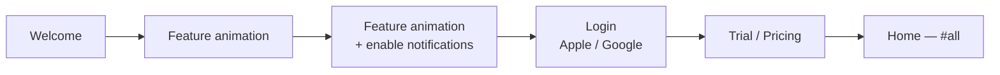
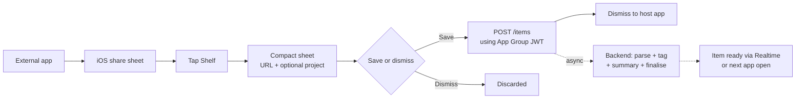
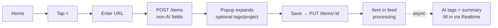
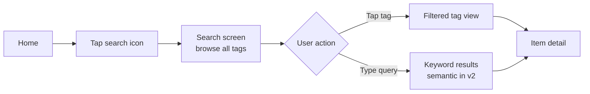

# Shelf — Product Requirements Document

> Design system (colours, typography, spacing, libraries): see [DESIGN.md](DESIGN.md).

## 1. Overview

**App name:** Shelf
**Tagline:** Save anything. Find everything.
**Platform:** iOS (v1)

### Problem

Content consumption is fragmented. YouTube Watch Later, Instagram Collections, browser bookmarks, Pinterest boards — a saved link ends up in the wrong silo or is never found again. Existing tools (Raindrop, Mymind) either lack intelligence or have poor UX. Nobody nudges you back to what you saved.

### Solution

Shelf is a unified content-saving app. Share any link from any app — Shelf parses the content, AI assigns tags automatically, and semantic search finds it even if you search with different words. A per-item reminder ensures saved content doesn't rot.

### Target user

People who actively consume content across multiple platforms and suffer from the "saved to never return" problem — learners, researchers, content creators, professionals building knowledge in a domain.

### Terminology

The saved entity is an **item**. In v1 every item is a **link** (a URL — website, YouTube, Instagram, TikTok, etc.). Images and PDFs are deferred (§5 Out) but the data model, API, and types are named generically (`item`, `/items`) so those kinds slot in without a rename. Data model, API, and code use "item"; older UI prose and screen names that say "link" refer to the link-kind item and will be renamed to "item" during the data-layer build.

---

## 2. Competitive landscape

| App | What it does well | Why it falls short |
|---|---|---|
| Raindrop.io | Share extension, link storage, cross-platform | No AI tagging, no semantic search, no reminders, dated UI |
| Mymind | AI tagging concept, clean idea | Weak semantic matching (soy ≠ soya), cluttered UI, expensive |
| Pocket / Instapaper | Read-later for articles | Articles only, no video, no AI |

### Shelf's differentiation

- Truly semantic search (embeddings, not keyword matching — soy surfaces soya)
- AI tagging from actual content (YouTube transcripts, Instagram captions, full webpage text)
- Per-item reminders to consume saved content
- Warm, spacious, breathing-room UI — the opposite of Raindrop's file-manager feel

---

## 3. Design language

### Philosophy

The app should feel like a clean desk — calm, organised, never cluttered. Every interaction should feel effortless. The user should feel relief when opening the app, not anxiety.

### Visual

- **Colours:** Warm, light palette. Off-whites, warm creams, soft warm accents. No dark/daunting surfaces.
- **Spacing:** Generous. Cards have breathing room. Nothing is cramped.
- **Typography:** Clean, readable, minimal weight variation.
- **Corners:** Consistently rounded, friendly.

### Micro-interactions

- Scroll bar on projects view shrinks with a bouncy animation at scroll extremes
- Item detail thumbnail shrinks slightly as user scrolls up (parallax)
- Create project bottom sheet slides up from bottom
- Add-link popup expands in place once the create call returns
- Tab switch: smooth horizontal slide

---

## 4. Monetisation

| | |
|---|---|
| Free trial | 5 days, full access |
| Monthly | $3.00 / month |
| Annual | $30.00 / year |
| Payment | Apple In-App Purchase (Apple takes 15–30%) |
| Auth | Apple Sign In + Google Sign In (no email/password in v1) |

---

## 5. V1 Scope

### In

- iOS share extension (save from any app)
- Manual link input (paste field inside app)
- Content parsing:
  - **Websites:** title, thumbnail, full page text (for AI tagging only), meta description
  - **YouTube:** title, thumbnail, description + transcript (unofficial API, async)
  - **Instagram:** caption + thumbnail (HTML scraping, accepted fragility — public posts only)
- AI auto-tagging: 10 tags per item, user can add more manually (worker outputs `name`, `summary`, `tags`, `consume_time`)
- Every item auto-assigned `#all` tag
- Project organisation (optional — items are first-class without a project)
- **Keyword search** (client-side over `name` / `tags` / `summary`)
- Per-item reminder toggle — **stored** (`reminder_enabled`); notification delivery is v2
- Top 5 tags by frequency in tab bar
- Per-user deduplication (a user can't hold the same URL twice)
- Warm, spacious UI

### Out (v2+)

| Feature | Reason deferred |
|---|---|
| Semantic search (embeddings) | v1 search is client-side keyword over `name`/`tags`/`summary`. v2 adds embedding generation, pgvector, and a `POST /search` endpoint (§8.6). |
| Embedding generation + re-embed-on-edit | No embeddings in v1 (search is keyword). The worker generates them and the edit-triggered re-embed only ship with semantic search (§8.6). `raw_content` is still stored in v1 as the future base. |
| Failure retry (`reprocess`) | v1: a `failed` item offers **Remove** (re-add manually). The reprocess endpoint + re-invoke path are v2 (§8.2, §8.7). |
| Reminder notification delivery | v1 stores the toggle only; scheduling/delivery (local or push) is v2 (§8.5). |
| Image & PDF items | URL-kind items first; images/PDFs add upload UI, file limits, PDF text extraction, image vision-for-tagging. Data model keeps a generic `type` so they slot in later. When built, files go to **Supabase Storage** (not raw S3 — stays in one platform, integrates with RLS/auth). |
| Global dedup | v1 dedups per-user only. v2: if any user already processed a URL, copy the processed result instead of re-parsing (§8.3). |
| Read-only link sharing | Nice, not core to the save→find→consume loop |
| Collaborative collections | Significant scope |
| Android | Validate on iOS first |
| Notes/annotations on items | Useful but not the core thesis |
| YouTube transcript in search | v1 uses transcript for tagging; full-text search excluded |

---

## 6. Screens

### 6.1 Onboarding (first-time opening)

**Flow:** Welcome → Feature animation → Feature animation + enable notifications → Login → Free trial / Buy now → Home (`#all`)

- 2–3 feature animation screens highlighting core value props
- Notification permission requested on 3rd onboarding screen
- Login screen: "Continue with Apple" (black) + "Continue with Google" (white), privacy note at bottom
- Pricing screen: 5-day free trial or Buy now — $3/month or $30/year

---

### 6.2 Home screen

**Header:**
- `☰` hamburger menu — far left, opens left sidebar drawer
- "Shelf" — centred
- `🔍` search icon + `📅` calendar icon — far right (calendar hidden on the Projects tab)

**Tab bar (below header, horizontally scrollable):**

`projects` | `#all` (default, underlined on load) | top 5 tags by frequency (scrollable). Switch tabs by tap or swipe.

**Projects tab:**
- 2-column grid of project cards
- Each card: auto-generated 2×2 thumbnail collage from first 4 item thumbnails (fallback: warm gradient + project name)
- Custom scroll bar with bouncy/shrink animation at extremes

**Tag tabs (`#all` + individual tags):**
- Items grouped by week in descending order
- Each week group: 2.5-column horizontal scroll row
- Each card: thumbnail + name + source platform icon, plus a consume-time badge (clock icon + formatted `consume_time`, e.g. "12m") overlaid on the thumbnail. The badge is **hidden when `consume_time` is blank/`null`** — never render an empty pill.
- Card reflects item `status` (§8.2): `processing` → skeleton fill-in (non-clickable for file items until terminal), with a soft "taking a while…" hint after ~30–45s; `failed` → failure affordance with **Try again** (→ reprocess) then **Remove**; `ready` → normal card.

**Calendar / date filter:**
- The `📅` icon opens a calendar bottom sheet; days that have saved items are marked
- Selecting a day filters the active feed (tag or project) to that day, shown as a 2-column grid
- The icon switches to a filled accent state while a date is active; tapping it again clears the filter and restores the week-grouped feed
- Available on every tab except Projects

**FAB:** `+` bottom right — opens manual add flow

---

### 6.3 Add-link popup

The in-app **manual add** flow (`+` → enter URL). On `POST /items`, the popup expands to show the **non-AI** fields the create returned, and lets the user optionally tag before committing. It does **not** wait for AI — tags/summary stream in afterwards. The share extension does not use this popup (§6.10); file adds skip it entirely (§8.8).

**Flow:** enter URL → `POST /items` → popup expands with returned details → user optionally adds tags/project → **Save** → `PUT /items/:id` writes the user fields → item appears in the feed (still `processing` for AI).

**Fields:**

| Field | Behaviour |
|---|---|
| Name | Editable, pre-filled with the returned `title` |
| Source | Shown (platform icon), immutable |
| Consume time | Shown when returned, immutable |
| Tags | Optional, user-entered; AI tags merge in later |
| Project | Optional, autocomplete from existing projects |
| Link | Immutable |
| Reminder | Push notification toggle |

Summary is AI-generated and not shown here — it fills in on the item later.

**Actions:** Save button + swipe down to dismiss

---

### 6.4 Item detail screen

**Header:** Large thumbnail — shrinks slightly on scroll (parallax). Tapping thumbnail opens original URL in Safari.

**Body:**
- NAME (tap to edit) — first two words in `accent`, rest in `primary` (same client-side rule as the card)
- Source platform icon (Instagram / YouTube / Website) + domain
- Consume-time line below the source (clock icon + time, accent colour) — start-aligned with the source row and matching its text size; hidden when `consume_time` is blank
- Summary (immutable)
- Tags (editable)
- Reminder toggle (editable)

**Footer:**
- Persistent "Open" button — opens original URL
- Delete button below Open

---

### 6.5 Search screen

**Empty state (no query):**
- Search bar at top (auto-focused)
- "Browse by tag" label
- All tags as flowing wrap of pill chips — tap to filter. Doubles as the tag browser for tags not surfaced in the top-5 tab bar.

**Results state (query typed):**
- **v1: client-side keyword match** over `name` / `tags` / `summary` of the already-loaded items (no backend call).
- **v2: semantic results** (embeddings — soy surfaces soya) via `POST /search` (§8.6).
- Same card format as main feed (thumbnail + name + source icon + tags)
- Results update as user types (debounced)

---

### 6.6 Create project

Tap `+` on home → bottom sheet slides up:
- Drag handle at top
- "New project" label
- Single text input (auto-focused, keyboard appears) — **20 character limit**
- "Create" button (disabled until name is entered)

Project name is stored and displayed in title case (e.g. "app launch ideas" → "App Launch Ideas").

Project thumbnail auto-generates as items are added (2×2 collage of first 4 item thumbnails, fallback warm gradient + name).

---

### 6.7 Settings (sidebar drawer)

Triggered by `☰` — slides in from left.

**Sections:**
- Account (profile photo, name, email)
- Subscription (current plan, manage via Apple IAP)
- Notifications (global toggle)
- About (version, privacy policy, terms of service)

---

### 6.8 Empty states

**Home (`#all`, no items saved):**
Bookmark icon in a circle + "Nothing saved yet" + "Share any link to Shelf from any app, or tap + to add one manually."

**Empty project:**
"No items in this project yet." + add item button.

---

### 6.9 Project detail

Triggered by tapping a project card from the Projects tab.

**Header:**
- `←` back arrow — far left
- Project name — centred (replaces "Shelf" logo), displayed in title case
- Font size shrinks to fit on a single line for longer names (max 20 chars)
- `✏️` pencil icon + `📅` calendar icon — far right

**Tab bar:** Same horizontal scroll tag bar as home. Tapping a tag navigates to the global tag view for that tag (not filtered within the project).

**Body:**
- Items in this project grouped by week in descending order
- Same 2.5-column horizontal scroll rows as the tag feed
- Same card format: thumbnail + consume-time badge (hidden when blank) + title (`name`, first two words in `accent`, rest in `primary` — client-side rule)

**FAB:** `+` bottom right — opens manual add flow with this project pre-selected.

**Edit / delete (pencil icon):**
Opens a bottom sheet (same pattern as create project):
- Drag handle at top
- "Edit project" label
- Rename text input (pre-filled with current name)
- "Save" button
- Red "Delete project" option below Save → confirmation asks **whether to also delete the items** in the project, or keep them (they become project-less). The choice maps to the `delete_items` flag on `DELETE /projects/:id` (§8.7).

**Empty state:** "No items in this project yet." + add item prompt.

---

### 6.10 Share extension sheet

The iOS share extension is how items enter Shelf from other apps (Safari, TikTok, Instagram, YouTube, etc.). It runs in a **separate sandboxed process** from the main app and stays in-place over the host app — it never launches the main app (Pattern A).

**Behaviour:**
- User taps Shelf in the iOS share sheet → compact sheet appears over the host app
- Shows the shared URL (read-only) and an **optional project picker** (autocomplete from existing projects)
- **Save** button → fires the item to the backend, then dismisses back to the host app
- The extension does **not** parse content, generate tags, or wait for AI — it only hands the URL to the backend. All processing happens on the backend after dismissal.

**What "Save" does:**
1. Reads the user's JWT from the shared **App Group** container (written there by the main app on login)
2. POSTs the URL (+ optional `project_id`) to the backend `POST /items` endpoint
3. Dismisses immediately (~200ms; no AI wait)
4. Backend asynchronously parses content, runs AI tagging/summary, and advances the item to a terminal status (embedding in v2)
5. The item appears in the main app via Realtime (if open) or its next fetch

**Not-signed-in edge case:** If the App Group has no JWT (user shared a link before ever signing in), the sheet shows "Open Shelf to sign in first" instead of the save UI.

**Shared files (v2, deferred):** a shared image/PDF runs the file path — validate size/type → `POST /items` with a file body → upload to the returned `upload_url` (§8.8), same as the in-app file add minus the picker.

**Fields:**

| Field | Behaviour |
|---|---|
| Link | Immutable, shown read-only |
| Project | Optional, autocomplete from existing projects |

**Actions:** Save button + swipe down to dismiss (discards). See §8.5 for the architecture.

---

## 7. User flows

### 7.1 First-time opening

---

### 7.2 Share from external app

The extension stays in-place over the host app and hands the item to the backend, which processes it asynchronously.

---

### 7.3 Manual add

---

### 7.4 Search

---

## 8. Technical decisions

> Tech stack & infrastructure: see §8.9. In short — Supabase (Postgres + pgvector + Realtime + Storage + Auth), direct client + RLS for plain CRUD, and Python on AWS Lambda for the two smart endpoints and the worker.

### 8.1 Data model

**Items** (key fields):

| Field | Mutable | Notes |
|---|---|---|
| `id` | No | Server-assigned on create; returned immediately |
| `user_id` | No | Owner; scopes RLS and the dedup constraint |
| `type` | No | `link` in v1; `image` / `pdf` reserved (deferred) |
| `url` | No | The shared URL (link-kind items) — original, as received |
| `normalized_url` | No | Canonicalised `url` used as the dedup key; `unique (user_id, normalized_url)` |
| `status` | Derived | Processing lifecycle (§8.2). `awaiting_upload` (file uploads, v2) / `processing` / `ready` / `failed` |
| `processing_started_at` | Derived | Timestamp the current processing attempt began; reset on retry. Watchdog fails the row if `now() > processing_started_at + deadline` (§8.2) |
| `raw_content` | No | Immutable base for all embedding generations; populated during processing. Kept user-agnostic for future global dedup (§8.3) |
| `name` | Yes | Pre-filled from the parsed `title` (non-AI, in the create response); user editable |
| `tags` | Yes | 10 AI-generated (async, by the worker); user can also add their own (in the add-link popup or later) |
| `summary` | No | AI-generated |
| `thumbnail_url` | No | From OG/Twitter tags or oEmbed; may arrive in the fast create response |
| `consume_time` | No | Estimated time to consume, in **seconds** (read / watch / listen). Derived during processing (§8.4). `null` when not applicable or unknown; UI hides the badge when blank |
| `embedding` | Derived (**v2**) | `raw_content + current name + current tags` → one vector. Not generated in v1 (search is client-side keyword, §8.6) |
| `project_id` | Yes | Optional; FK → `projects.id`. On project delete, either the items are deleted or `project_id` is set null, per the `delete_items` flag (§8.7) |
| `reminder_enabled` | Yes | Push notification toggle |
| `source` | No | `instagram` / `youtube` / `website`. Anything outside YouTube/Instagram (TikTok, X, etc.) classifies as `website` in v1 — no dedicated parse strategy (§8.4) |
| `created_at` | No | Save timestamp; drives the week-grouped feed |

**Projects:**

| Field | Mutable | Notes |
|---|---|---|
| `id` | No | Server-assigned |
| `user_id` | No | Owner; scopes RLS |
| `name` | Yes | Stored + displayed title-cased, ≤ 20 chars (§6.6) |
| `created_at` | No | Creation timestamp |

`linkCount` is **not stored** — project membership (and the 2×2 collage) is derived client-side from the item list.

Every item auto-gets the `#all` tag. Tag filtering, top-5 tag computation, and project membership are all derived client-side from the full item list (§8.6).

### 8.2 Processing & sync model

Items are created optimistically and enriched asynchronously. The user never waits for AI.

**Create (fast path, < 2s):**
- `POST /items` with the URL creates the row at `status: 'processing'` and returns it straight away with the **non-AI** fields it can resolve within a hard timeout: `source`, `title`, `thumbnail_url`, `consume_time` (and `raw_content`). A slow origin returns whatever arrived rather than blocking; the rest fills in via enrichment.
- **AI fields are always async** — `tags`, `summary` (and the YouTube transcript that feeds them; `embedding` in v2) are produced by the worker, never awaited on create.
- **Manual add** (in-app `+`): the create response populates a confirm popup (§6.3); the item enters the feed on Save. **Share / file**: the item enters the feed immediately, no popup. Either way, AI fields stream in later via Realtime.

**Status lifecycle (the "complete" mechanism):**
- `awaiting_upload` → file-upload items only (v2): row created and presigned URL issued, file not yet in storage. URL items skip this and start at `processing`.
- `processing` → enrichment underway (content fetch, AI `name`/`summary`/`tags`/`consume_time`; embedding is v2)
- `ready` → terminal; fully enriched
- `failed` → terminal; could not produce a usable item (URL unreachable, or a file upload that never completed / is corrupt)
- "Complete" = any **terminal** state (`ready` / `failed`). The client stops watching an item once terminal.
- **No `partial` state.** Enrichment degrades gracefully and still lands at `ready`: a missing YouTube transcript falls back to the description; if AI tagging fails after retries the item keeps `#all` + whatever was parsed and the user can add tags manually. `failed` is reserved for "nothing usable was produced."

**Live updates — Supabase Realtime:**
- The app subscribes to Postgres changes on `items where user_id = me and status not in (terminal)`.
- When the backend finishes and `UPDATE`s the row, the completed item is pushed over the websocket and the UI fills in. No polling — Realtime is the only live-update mechanism.

**Fetch / reconcile triggers (the safety net):**
- Full `GET /items` + `GET /projects` (parallel) on **session acquired**, on **foreground after background**, on **network reconnect**, and on **Realtime re-subscribe** (websocket drop→resume). This catches anything that completed while the app was closed/offline or while the subscription was briefly down — covering the gap a polling fallback would otherwise fill.
- No background work when the app isn't foregrounded; the next reconcile fetch catches up.
- Data fetching must be **gated on session** and re-run on logout→login (the store currently mounts outside the auth gate — see §10).

**Failure, watchdog & retry — the backend owns failure, never the client:**

The client only ever *reflects* a backend status; it never decides "failed" on a timer (that would split-brain against a backend that succeeds late). So:

- **Watchdog.** A **pg_cron** sweep marks any item stuck in `processing` past a deadline as `failed` (`now() > processing_started_at + deadline`). This bounds the skeleton — an item cannot sit in `processing` forever. The deadline must sit **above P99 processing time** (order of 60–120s for an LLM-tag + embed + parse pipeline, not seconds); it is a safety net for crashed/hung workers, not a tight SLA. A too-short deadline marks healthy jobs failed. (If pgmq is added later, its visibility-timeout/DLQ can take over this role — §8.9.)
- **No attempt token.** Given the worker is the only writer of `status`, does a **single guarded terminal write**, and is idempotent on anything outside the item row, a fencing token is unnecessary. The guards are:
  - Worker terminal write: `UPDATE … SET status='ready'/'failed' … WHERE id = ? AND status = 'processing'`
  - Watchdog: `UPDATE … SET status='failed' WHERE id = ? AND status = 'processing' AND now() > processing_started_at + deadline`
  - Retry (reprocess): `UPDATE … SET status='processing', processing_started_at = now() WHERE id = ? AND status = 'failed'`
  - A late "zombie" worker from a timed-out attempt finds the row no longer `processing` and no-ops. A retry re-enters `processing` and **resets `processing_started_at`** (else the watchdog instantly re-fails it). Accepted trade-off: with no token, a slow-but-healthy zombie's (valid) result can win over a retry's — fine for idempotent same-input reprocessing.
  - The worker writes **AI-owned fields only** (`name`/`summary` when unset, and **unions** AI tags with any user tags; `embedding` is v2); it never clobbers user-set `name`/tags. This keeps the manual-add Save (a `PUT` during `processing`) and the worker's write from racing destructively.
  - The `failed → processing` retry guard above is the **reprocess** path, which is **v2**. In v1 a `failed` item is terminal with no retry (Remove + re-add).
- **`DELETE` is blocked while `processing`** for every item — removes the delete-vs-late-success race; an item can only be deleted once terminal. **File items are additionally non-interactive** (skeleton, not clickable/openable) until terminal. The manual-add Save `PUT` is the creation completing and is allowed.
- **Retry (`POST /items/:id/reprocess`) is v2** (§8.7) — when built it's a dedicated endpoint, not create (which mints a new id and would duplicate), capped (default 2, tunable). **v1:** a failed item offers **Remove** only.

**Client states on a card / detail:**
- `processing`: skeleton fill-in for the not-yet-arrived fields; a soft "taking a while…" hint after ~30–45s (cosmetic only — never a failure verdict or destructive action).
- `ready`: normal item.
- `failed`: a failure affordance — **v1: Remove**; **v2** adds **Try again** (calls reprocess, up to the cap) before Remove.

### 8.3 Deduplication

**v1 — per-user dedup.** A user can't hold the same URL twice.

- **Match key:** `normalized_url`, enforced by `unique (user_id, normalized_url)`.
- **Normalisation (conservative):** lowercase scheme + host, strip default port, drop the URL fragment, remove trailing slash, strip well-known tracking params (`utm_*`, `fbclid`, `gclid`, `igshid`, `si`, …), and sort the remaining query params. **Meaningful params are kept** (e.g. YouTube `?v=`, article `?id=`) — under-normalising (a missed dup) is safer than over-normalising (merging distinct content).
- **On collision, `POST /items` is idempotent** — it returns the existing item (not an error), so callers don't special-case it:
  - **Manual add:** surface the existing item (navigate / highlight) with an "Already in your shelf" toast. If a project was chosen and the item has **no** project, file it into that project; if it already has a different project, leave it and just surface (no silent move).
  - **Share extension:** fire-and-dismiss as usual; the returned existing id is a no-op save, sheet shows "Already saved ✓" (same project-if-empty rule).

**v2 — global dedup (deferred).** If *any* user has already processed a URL, copy the processed result instead of re-parsing/re-tagging.

- Only the **user-agnostic, immutable** artifacts are shareable: `raw_content`, `thumbnail_url`, source title, `summary`, and the initial AI tags / initial `embedding`. Per-user mutable state (`name`, edited `tags`, `project_id`, `reminder_enabled`) is never copied.
- Implies a global, normalized-URL-keyed processed-content store separate from per-user items. v1 keeps `raw_content` / `summary` user-agnostic so this is a clean addition later.

### 8.4 Content parsing

| Source | Method | Notes |
|---|---|---|
| YouTube | Official oEmbed/Data API + unofficial transcript API | Transcript fetch is async; fallback to title + description if unavailable |
| Instagram | HTML scraping of public pages | ToS risk accepted; public posts only; maintenance liability |
| Websites | Full page text fetch | Full text → AI for tagging; search operates on tags + title only (not raw page text) |

**`consume_time` derivation:**
- **Websites / articles:** estimate from `raw_content` word count at ~225 wpm → seconds.
- **YouTube:** actual video length from the oEmbed/Data API.
- **Instagram:** none — `null` (no natural duration; badge hidden).
- **Images / PDFs (deferred):** images `null`; PDFs may estimate from extracted text word count.

### 8.5 AI tagging & share extension architecture

**AI tagging:**
- One **Gemini 2.5 Flash-Lite** call per saved item → `name`, `summary`, 10 `tags` (a single structured-output call). `consume_time` is derived non-AI (§8.4). Dirt cheap — fractions of a cent per item. (Embedding generation is **v2**, OpenAI `text-embedding-3-small` — §8.6.)
- **Always async** across every entry point (manual add, share, file). The worker generates the fields after create; they stream into the item via Realtime. Manual add lets the user add their own tags in the popup (§6.3); the AI tags merge in when ready.

**Reminders:** v1 stores the per-item `reminder_enabled` toggle only. Scheduling and delivery (local notification vs server push) are **v2** — nothing fires a notification in v1.

**Share extension architecture:**
- The extension is a separate process and cannot access the main app's Supabase session directly.
- **App Group** shared container bridges them: the main app writes the user's JWT (access + refresh token) to the App Group on login and on token refresh; the extension reads it when it needs to make an authenticated call.
- On Save, the extension POSTs `{ url, project_id? }` to `POST /items` using the App Group JWT, then dismisses (~200ms, no AI wait).
- The backend treats a share-created item as a processing job: parse content → AI `name`/`tags`/`summary`/`consume_time` → advance to terminal status (embedding in v2). The main app picks it up via Realtime (if open) or its next `GET /items`.
- If the App Group has no JWT (link shared before first sign-in), the extension shows a "Open Shelf to sign in first" message rather than the save UI.
- The main app auto-refreshes its access token (`autoRefreshToken`) and writes the latest tokens to the App Group. But the extension is a separate process without that refresh loop, and access tokens last ~1h — so if the access token from the App Group is expired, the extension **refreshes it itself using the stored refresh token** before calling `POST /items`, rather than failing.

### 8.6 Search

**v1 — keyword (client-side).** Search runs entirely on the device over the already-loaded items: case-insensitive substring/keyword match against `name`, `tags`, and `summary`. No backend call, no endpoint, no embeddings. (This is the current frontend behaviour — promote it from stand-in to the v1 mechanism.)

**v2 — semantic (deferred).** The differentiator (soy surfaces soya):

- **Embeddings:** OpenAI `text-embedding-3-small` → pgvector on Supabase; HNSW index for sub-50ms queries.
- **What gets embedded:** `raw_content + current name + current tags` per item. The worker generates it; `raw_content` (already stored in v1) is the immutable base, so v2 needs no re-fetch.
- **Search endpoint:** `POST /search { query }` (Lambda) — embeds the query (OpenAI key is server-side only), runs the pgvector similarity query, returns items.
- **Re-embed on edit:** async — a name/tag edit fires a Postgres trigger → pg_net → the worker in `reembed` mode (regenerates only the embedding), guarded so the worker's own write doesn't self-trigger. Brief, harmless search staleness.
- **Website search scope:** tags + title only, not raw page text.

`raw_content` is stored immutably in **v1** even though nothing reads it yet, so v2 embeddings (and global dedup, §8.3) drop in without re-fetching.

### 8.7 API surface

Most of the surface is **not** a hand-written endpoint — the app calls Supabase directly and **RLS** (`user_id = auth.uid()`) enforces ownership. In **v1 only `POST /items` is a backend (Lambda) function**; `reprocess` and `POST /search` are v2 (§8.9).

| Method | Endpoint | Where | Purpose |
|---|---|---|---|
| GET | `/items` | Direct + RLS | Load all items (full rows) |
| GET | `/projects` | Direct + RLS | Load all projects on open (catches empty projects) |
| POST | `/items` | **Lambda** | **Create** — body branches on kind. **Link:** `{ url, project_id? }` → fast non-AI enrichment (`source`, `title`, `thumbnail_url`, `consume_time`), row at `processing`, returns the entity; idempotent on `normalized_url` collision (§8.3). **File (v2):** `{ type, filetype, size, project_id? }` (app pre-validates) → row at `awaiting_upload`, returns `{ id, upload_url }` (presigned PUT, 3-min TTL, type/size-constrained, id in object key). See §8.8 |
| PUT | `/items/:id` | Direct + RLS | **Update** — manual-add Save (user tags / project / name) and later edits. A name/tag change fires the async re-embed trigger (§8.6) |
| POST | `/items/:id/reprocess` | **Lambda (v2)** | **Retry** a `failed` item (§8.2). Guarded `failed → processing`, resets `processing_started_at`, re-invokes the worker. Artifact present (file in storage / link URL) → just re-invoke; a file upload that never landed → returns a fresh `{ upload_url }` and sets `awaiting_upload` so the app re-uploads. **v1 has no retry** (failed → Remove) |
| POST | `/search` | **Lambda (v2)** | Semantic search — embeds the query, pgvector similarity, returns items (§8.6). **v1 search is client-side keyword, no endpoint** |
| POST | `/projects` | Direct + RLS | Upsert project — create (no id) or update (id present) |
| DELETE | `/items/:id` | Direct + RLS | Delete an item (rejected while `processing` — items are untouchable until terminal, §8.2) |
| DELETE | `/projects/:id` | Direct + RLS | Delete a project. Body `{ delete_items: bool }` — `true` deletes the project's items; `false` orphans them (`project_id → null`). The app prompts the user to choose (§6.9) |

Synchronous failures of `POST /items` (create) and of the direct upload PUT are surfaced to the user as a **"try again"** error before any item is committed to the feed.

**Frontend data strategy:**
- Both GET endpoints fire in parallel on session-acquired and on foreground (§8.2)
- All items loaded in full (no partial fields) — ~150KB at 100 items, trivially small
- Tag filtering, top-5 tag computation, and project membership all derived client-side
- Live fill-in of in-flight items via Supabase Realtime; reconcile GETs are the safety net (no polling)
- No pagination in v1; add cursor-based pagination if per-user item count grows past ~500

### 8.8 Item ingestion — end-to-end flow

Both kinds of item — URL (v1) and file (v2, deferred) — share one processing pipeline and the §8.2 lifecycle (optimistic create → `processing` → worker → terminal, with Realtime fill-in, watchdog, and reprocess). They differ only in how the content reaches the backend.

**Worker trigger is decoupled from any single source.** Three things can kick off processing — a link row insert, a `storage.objects` insert (file landed), and the reprocess endpoint — and they all funnel through one path: a Postgres trigger fires **pg_net** (async, non-blocking HTTP) to invoke the worker with `{ item_id, mode: 'process' }`. The worker is trigger-agnostic and reads whatever artifact the row points at (the storage object for files, the URL for links). This is what lets retry re-run processing without a re-upload. (No queue in v1 — see §8.9 for the pg_net-direct vs pgmq trade-off and upgrade path.)

**URL item — in-app manual add (v1):**
1. App `POST /items { url, project_id? }`. Backend dedups (§8.3), does fast non-AI enrichment (`source`, `title`, `thumbnail_url`, `consume_time`), creates the row at `processing`, fires the worker via pg_net, returns the entity. Create error → "try again" (nothing enters the feed).
2. The add-link popup (§6.3) expands with those fields; user optionally adds tags/project → **Save** → `PUT /items/:id` writes the user fields. The item now enters the feed (AI fields in skeleton).
3. Worker (`process` mode): parse content → AI `name`/`tags`/`summary`/`consume_time` → guarded terminal write to `ready` (or `failed`). (Embedding is added here in v2 — §8.6.)
4. Realtime pushes the finished row; the app fills it in (or shows the failure affordance). Foreground/reconnect GET is the safety net.

**URL item — share extension (v1):** same backend path, but the extension `POST /items` after the optional-project step and dismisses — no popup, no `PUT`; the item enters the feed and fills in via Realtime / next fetch (§6.10).

**File item (v2, deferred):** files go to **Supabase Storage** (S3-backed, S3-compatible). Same for the in-app picker and a share-sheet file (the share just skips the picker).
1. App pre-validates size + type, then `POST /items { type, filetype, size, project_id? }`. Backend creates the row at `awaiting_upload` and returns `{ id, upload_url }` — presigned PUT, 3-min TTL, type/size-constrained, id encoded in the **object key** (`uploads/{user_id}/{item_id}.{ext}`) so the storage event carries id + owner (no metadata reliance).
2. App shows the item in the feed **immediately under a skeleton overlay**, every attribute in skeleton state. **Not clickable / won't open until `ready`.** Images: local file URI behind the skeleton (optimistic thumbnail); PDFs: document placeholder until the worker renders a first-page preview.
3. App uploads directly to `upload_url`. Upload error → "try again".
4. A trigger on the `storage.objects` insert fires the worker via pg_net with the id from the key.
5. Worker processes as above → `ready` / `failed`; Realtime fills in or shows failure.

**Retry (both kinds) — `POST /items/:id/reprocess`** — **v2** (§8.2, §8.7). When built:
- Artifact present (file in storage / link URL): guarded `failed → processing`, reset `processing_started_at`, re-invoke the worker. No re-upload.
- File upload never landed: endpoint returns a fresh `{ upload_url }` and sets `awaiting_upload`; the app re-uploads (→ storage trigger → worker).
- **v1:** a `failed` item has no retry — the user removes it and re-adds.

**Orphan handling:** presigned URL expires at 3 min; items left in `awaiting_upload` past that window are swept to `failed` (the same pg_cron sweep as the watchdog) so the feed never shows a permanent skeleton.

### 8.9 Tech stack & infrastructure

Guiding constraint: **no users yet, slow scale → no ever-running infra, on-trigger cost only, stay inside free tiers.** Everything below is scale-to-zero or part of Supabase's free tier.

| Concern | Choice | Why |
|---|---|---|
| DB, Auth, Realtime, Storage | **Supabase** (free tier) | One platform; Postgres + pgvector + Realtime + Storage + Auth. RLS is the authz layer |
| Plain CRUD (reads, edits, deletes, projects) | **Direct Supabase client + RLS** | No backend code or cost; JWT auto-attached, `user_id = auth.uid()` enforces ownership |
| Smart endpoint (`POST /items`) + worker | **Python on AWS Lambda** | Python's fetch/scrape/LLM ecosystem; scale-to-zero, large perpetual free tier; holds the OpenAI + service-role secrets. (v1 has **one** app-facing Lambda — create; `reprocess` and `POST /search` are v2.) |
| Trigger (event → worker) | **Postgres trigger → pg_net** (async HTTP) | In-DB, no queue/poller; fires the Lambda without blocking the insert |
| Watchdog + orphan sweep | **pg_cron** | In-DB periodic sweep; fails stuck `processing` / abandoned `awaiting_upload` rows |
| Live updates (backend → app) | **Supabase Realtime** | Already chosen (§8.2); no polling |

**Auth.** The app sends the Supabase JWT on every call. Direct-CRUD relies on RLS. The Lambda endpoints verify the JWT (Supabase JWKS, `sub` = `user_id`); the worker uses the **service-role key** (bypasses RLS — it acts for the system) and scopes every write by the job's `item_id`. Service-role + Gemini (and the v2 OpenAI-embedding) keys live only in Lambda, never on the device.

**No queue in v1.** `trigger → pg_net → Lambda` directly, no pgmq. At zero traffic a queue's buffering/retry earns nothing and adds plumbing. Reliability is covered by in-invocation retries (transient errors) + the pg_cron watchdog (stuck → `failed`); a `failed` item is removed and re-added in v1 (the `reprocess` retry path is v2). **Upgrade path:** when volume or reliability needs it, insert **pgmq** (`trigger → pgmq.send`, Lambda drained by pg_cron or an SQS-style consumer) — the worker code barely changes, and pgmq's visibility-timeout/DLQ can then own the watchdog role.

**No provisioned concurrency.** It is billed separately (no free-tier allowance) and is a fixed ~$5–11/mo always-on charge — exactly the ever-running cost we're avoiding, for near-zero benefit (the worker is cold-start-insensitive; only `POST /items`'s ~2s feel is affected, occasionally). Accept cold starts at this scale; if `create` latency ever hurts, reach for a slim zip package or Lambda **SnapStart** (Python) — both stay scale-to-zero — before PC.

**Worker modes** (dispatched by the `mode` in the pg_net payload):
- `process` (**v1**) — pipeline: fetch content → AI `name`/`tags`/`summary`/`consume_time` → guarded terminal write to `ready`/`failed`. (Embedding generation is added to this mode in v2.)
- `reembed` (**v2**) — embed-only: read `raw_content` + current `name`/`tags`, regenerate just the `embedding` column. Triggered by a user name/tag edit (§8.6), guarded (`embedding` unchanged) so the worker's own write doesn't self-trigger. Ships with semantic search.

**Cold-start caveat:** `POST /items` does a live OG-tag fetch under a ~1.5s timeout; a Lambda cold start (~1–2s) on top could occasionally exceed the 2s feel. Tolerable solo; if needed, move only `create` to a fast-cold-start Deno edge function (one TS file) while the worker stays Python.

---

## 9. Decision log

Settled decisions and the reasoning behind them. Detail lives in the sections referenced; this is the quick-scan index.

### Product & monetisation
| Decision | Rationale | Ref |
|---|---|---|
| Name "Shelf", tagline "Save anything. Find everything." | — | §1 |
| iOS only for v1 | Validate on one platform before Android | §1, §5 |
| Auth: Apple + Google Sign In, no email/password | Lower friction, no credential management | §4 |
| 5-day free trial → $3/mo or $30/yr via Apple IAP | — | §4 |

### Scope
| Decision | Rationale | Ref |
|---|---|---|
| Entity noun is **item**; v1 items are all links | Images/PDFs deferred but model stays generic so they slot in without a rename | §1, §5 |
| Share extension + manual paste in v1 | Core save paths | §5, §6.10 |
| Content parsing: websites / YouTube (+ transcript) / Instagram | Covers the dominant save sources | §8.4 |
| AI auto-tagging: 10 tags/item, user can add | Cheap, high-value differentiator | §8.5 |
| AI model: **Gemini 2.5 Flash-Lite** for name/summary/tags (one structured call); OpenAI `text-embedding-3-small` for embeddings (v2) | Cheap, fast, structured output for tagging; embeddings deferred to v2 | §8.5, §8.6 |
| Projects optional; items first-class | Don't force organisation | §5, §6 |
| Every item auto-gets `#all` | Guarantees a default feed | §8.1 |
| Images/PDFs deferred → Supabase Storage when built | One platform, integrates with RLS/auth; S3-backed so the same presigned-upload flow applies; the event→worker trigger and completion push are native (vs DIY on raw S3) | §5, §8.8 |
| File upload flow: presigned PUT (3-min TTL, id in object key, type/size constrained) → storage event → worker → Realtime push; optimistic non-clickable skeleton; orphan sweep | Reuses the URL item lifecycle; instant feedback without waiting on AI; bounded abandoned-upload cleanup | §8.8 |
| Global dedup deferred to v2 | v1 dedups per-user only | §5, §8.3 |

### Navigation & screens
| Decision | Rationale | Ref |
|---|---|---|
| Default landing `#all`; tabs `projects` \| `#all` \| top-5 tags (tap or swipe) | — | §6.2 |
| Projects tab: 2-col grid, 2×2 collage cards | — | §6.2 |
| Tag/project feeds: week-grouped descending, 2.5-col horizontal rows | — | §6.2, §6.9 |
| Calendar date filter on every tab except Projects | Day grid; clears on toggle | §6.2 |
| Header: `☰` (sidebar) \| `Shelf` \| `🔍` + `📅` | — | §6.2 |
| Project detail header: `←` \| name \| `✏️` + `📅`; tag taps go to global tag view | Project-scoped search dropped — search is global | §6.9 |
| Add-link popup (manual add only): shows returned non-AI fields (source/title/consume-time), optional tags/project, Save → `PUT /items/:id`; no AI wait, AI fields stream in after | Share extension uses its own compact sheet; files skip the popup. Replaces the old "wait for AI then review pre-filled tags" overlay | §6.3 |
| Item detail: parallax thumbnail (tap→URL), name/source/summary/tags/reminder, persistent Open + Delete | — | §6.4 |
| Search: tag-pill browser empty state + debounced results (v1 client-side keyword over name/tags/summary; semantic v2); doubles as browser for non-top-5 tags | — | §6.5, §8.6 |
| Create/edit project: bottom sheet, 20-char limit, title-cased | — | §6.6, §6.9 |

### Technical
| Decision | Rationale | Ref |
|---|---|---|
| Optimistic create: `POST /items` returns immediately at `processing` with non-AI fields (source/title/thumbnail/consume-time); AI always async | User never waits on AI; item shows instantly | §8.2 |
| Endpoints — **v1:** `POST /items` create (one endpoint, body branches link vs file) + `PUT /items/:id` update (direct+RLS). **v2:** `POST /items/:id/reprocess`, `POST /search` | One create endpoint for both kinds; create/update separated; POST (not GET) since create writes a row | §8.7 |
| `status` enum: `awaiting_upload` (file uploads) → `processing` → terminal `ready`/`failed`; no `partial` | Enrichment degrades gracefully to `ready`; `failed` = nothing usable produced. Simpler than carrying a partial state nothing branches on | §8.2 |
| Supabase Realtime is the only live-update mechanism (no polling); reconcile GETs (incl. on Realtime re-subscribe) are the safety net | Instant fill-in without a polling loop; reconcile covers any missed push | §8.2 |
| Backend owns failure via a watchdog (deadline > P99); client never declares failure on a timer | Avoids client/backend split-brain (success-after-client-gave-up); bounds the skeleton | §8.2 |
| No attempt/fencing token; guard terminal writes on `WHERE status='processing'`, reset `processing_started_at` on retry | Items untouchable while processing + single guarded terminal write + idempotent side-effects make a token unnecessary; accepts a slow zombie's valid result winning | §8.2 |
| `DELETE` blocked while `processing` (file items also non-interactive); worker writes AI-owned fields only and unions tags, never clobbers user edits | Removes the delete-vs-late-success race; lets the manual-add Save `PUT` coexist with the worker | §8.2 |
| Retry (`POST /items/:id/reprocess`) is **v2** — dedicated endpoint (not create), capped (default 2) then Remove. **v1:** failed → Remove + re-add | Create mints a new id (would duplicate); no destructive auto-action | §8.2, §8.7 |
| Worker trigger decoupled from source: link insert / storage insert / reprocess all invoke the worker via pg_net (no queue v1) | Lets retry re-run without re-upload; worker is trigger-agnostic | §8.8, §8.9 |
| File upload (v2): Supabase Storage presigned PUT (3-min TTL, id in object key, type/size constrained); reprocess re-issues a URL only if the upload never landed | One platform, S3-backed; idempotent retry handling both failure stages | §8.8 |
| Optimistic, non-clickable skeleton until terminal; soft "taking a while" hint at ~30–45s; create/upload errors → "try again" | Instant feedback; comfort without a false failure verdict | §8.2, §8.8 |
| Fetch on session-acquired + foreground + network reconnect; no background polling; gate on session, re-fetch on login | Resource-cheap; safety-net reconcile across every resume path | §8.2 |
| Per-user dedup: `unique (user_id, normalized_url)`, idempotent POST, conservative normalisation | Idempotency keeps both callers simple; conservative norm avoids merging distinct content | §8.3 |
| Re-add files into a chosen project only if item has none | Never silently move an already-filed item | §8.3 |
| Semantic search is **v2**: `text-embedding-3-small` → pgvector/HNSW, `POST /search`, async re-embed-on-edit. **v1 = client-side keyword** (name/tags/summary). No embeddings generated in v1; `raw_content` still stored as the v2 base | Ship the cheap search first; embeddings are the differentiator but not v1-critical | §8.6 |
| AI worker outputs `name`/`summary`/`tags`/`consume_time` (single `name`, no AI-provided split); card + detail render `name`'s **first two words in accent**, rest primary — a client-side rule; summary on detail | DB model is final; the colour accent is pure frontend, no `descriptor` field to maintain | §8.1, §6.2, §6.4 |
| Reminder: **v1 stores the toggle** (`reminder_enabled`); scheduling/delivery (local vs push) is **v2** | Ship the field now; defer notification plumbing | §5, §8.5 |
| Project delete asks **delete items vs orphan** (`delete_items` flag on `DELETE /projects/:id`) | User decides; FK behaviour follows the flag (delete or set-null) | §6.9, §8.7 |
| Share extension self-refreshes its JWT via the App Group refresh token if the access token is stale | The extension doesn't run the main app's auto-refresh loop; the access token may be >1h old | §6.10, §8.9 |
| Two tables (`items`, `projects`), both `user_id`-scoped (RLS); `linkCount`/membership derived client-side, not stored | Minimal schema; counts can't drift from the item list | §8.1 |
| Stack: Supabase (DB/Auth/Realtime/Storage, free tier) + direct-client/RLS for CRUD + Python on AWS Lambda for the smart endpoint(s) & worker | No-users / slow-scale: scale-to-zero, on-trigger cost, free tier; Python for the fetch/scrape/LLM ecosystem | §8.9 |
| v1 backend = **one** Lambda (`POST /items` create) + worker; everything else is direct-to-Supabase + RLS. `reprocess` and `POST /search` are v2 | Server code only where there's an outbound fetch, a secret, or a lifecycle transition; minimal surface | §8.7, §8.9 |
| Trigger → pg_net → Lambda; pg_cron watchdog; **no queue in v1** (pgmq is the documented upgrade) | A queue earns nothing at zero traffic; retry covered by in-invocation + watchdog + reprocess | §8.8, §8.9 |
| **No provisioned concurrency** — accept cold starts; SnapStart/slim-package if `create` latency hurts | PC is a fixed ~$5–11/mo always-on charge (no free tier) for near-zero benefit | §8.9 |
| Worker modes: `process` (v1) / `reembed` (v2, embed-only) — one codebase | Re-embed shares the worker without re-running the pipeline or clobbering user tags | §8.6, §8.9 |
| Re-embed on edit (v2) is **async** (trigger → worker), not synchronous | `PUT` is direct-to-Supabase (no server hook, no client key); a few seconds of search staleness is harmless | §8.6 |
| `source` = `youtube`/`instagram`/`website`; everything else (incl. TikTok) is `website` in v1; keep the field (backend-authoritative classifier, remove client `inferSource` on build) | No dedicated TikTok parse in v1; one classifier not two | §8.1, §8.4 |
| `raw_content` immutable, user-agnostic, embedding base | Stable base; enables future global dedup | §8.1, §8.6 |
| `consume_time` as integer seconds, formatted client-side, badge hidden when blank | Media-agnostic (read/watch/listen); sortable/locale-flexible vs a pre-formatted string; no empty pills | §8.1, §8.4, §6.2 |
| Instagram scraping: ToS risk accepted, public posts only | Known maintenance liability | §8.4 |
| YouTube: async transcript fetch, fallback to title + description | Transcript API is unofficial/fragile | §8.4 |
| Website search: tags + title only, not raw page text | Keep search precise; raw text is for tagging | §8.4, §8.6 |

### Design
| Decision | Rationale | Ref |
|---|---|---|
| Warm, light, spacious; breathing room everywhere | The anti-Raindrop feel | §3 |
| Micro-interactions: bouncy scroll bar (projects), parallax thumbnail (item detail), bottom-sheet slide-up (create/edit project + post-processing overlay) | — | §3 |

---

## 10. Implementation status

_Snapshot: 2026-06-12. "Done" means the UI is built and working against an **in-memory mock store** ([`src/store/shelf.tsx`](../../app/src/store/shelf.tsx)) with **real Supabase authentication**. No application data is persisted to a backend yet._

| Area | Status | Notes |
|---|---|---|
| Auth (Apple / Google) | ✅ Done | Supabase OAuth, PKCE + S256, session persistence, auth gate to `/login` |
| Design system | ✅ Done | Colours, typography, spacing tokens ([`tokens.ts`](../../app/src/constants/tokens.ts)) |
| Home screen | ✅ Done | Header, top tab bar (`#all` / `projects` / top-5 tags), week-grouped feed, horizontal rows |
| Tab switch animation | ✅ Done | Reanimated horizontal slide |
| Projects grid + detail | ✅ Done | 2-col grid, 2×2 collage, inline project detail view |
| Calendar / date filter | ✅ Done | Marks days with items; day grid; clears on toggle |
| Item detail screen | ✅ Done | Name, source, summary, tags, reminder toggle, open/delete |
| Add item / create / edit project | ✅ Done | Bottom-sheet flows on mock data |
| Search screen (v1 keyword) | 🟡 Partial | Tag browser + live keyword results over name/tags/summary built — **this is the v1 mechanism** (no longer a stand-in); needs to point at real data. Semantic is v2 (§8.6) |
| Reminder toggle | 🟡 Partial | UI toggle built; v1 only persists `reminder_enabled` — notification delivery is **v2** (§8.5) |
| Card title rename + accent rule | ⛔ Pending | Frontend uses an AI `descriptor`/`title` split; DB model is single `name`. Collapse to `name`, and render its first two words in accent client-side (card + detail) (§8.1, §6.2, §6.4) |
| Liquid Glass | 🟡 Partial | Applied on the speed-dial FAB only; sheets/search still opaque |
| Settings drawer | 🟡 Partial | Drawer + sections present; account/subscription/notifications are static |
| Supabase schema + RLS | ⛔ Pending | `items` + `projects` tables, `user_id`-scoped RLS; direct-client CRUD wiring. Store mounts outside the auth gate ([_layout.tsx](../../app/src/store/shelf.tsx)) — must be gated on session + re-fetch on login |
| Backend function (AWS Lambda, Python) | ⛔ Pending | v1: `POST /items` (create + enrichment), JWT verify (§8.7, §8.9). `reprocess` + `POST /search` are v2 |
| Worker (AWS Lambda, Python) | ⛔ Pending | v1: `process` mode (no embedding); pg_net trigger; pg_cron watchdog; service-role writes. `reembed` mode is v2 (§8.9) |
| Optimistic create + status lifecycle | ⛔ Pending | `status` enum, fast OG/oEmbed create response (§8.2) |
| Realtime fill-in | ⛔ Pending | Supabase Realtime subscription on non-terminal items; reconcile GETs as the safety net, no polling (§8.2) |
| Per-user dedup | ⛔ Pending | `unique (user_id, normalized_url)`; idempotent `POST /items`; URL normalisation (§8.3) |
| AI tagging (name/summary/tags) | ⛔ Pending | Worker **Gemini 2.5 Flash-Lite** call not built; fields come from mock data (§8.5) |
| Content parsing | ⛔ Pending | `processLink.ts` is a URL-pattern stub — no YouTube/Instagram/website fetch (§8.4) |
| `raw_content` field | ⛔ Pending | Stored immutably in v1 as the v2-embedding base; not in the frontend model |
| Semantic search + embeddings (v2) | ⛔ v2 | pgvector, `text-embedding-3-small`, `POST /search`, `reembed` (§8.6) |
| Failure retry / `reprocess` (v2) | ⛔ v2 | v1 failed → Remove; reprocess endpoint + Try-again deferred (§8.2) |
| Reminder delivery (v2) | ⛔ v2 | v1 stores toggle only; scheduling/notification deferred (§8.5) |
| `consume_time` field | 🟡 Partial | Frontend renamed `duration` → `consumeTime`; badge hidden when blank (§6.2) ✅. Still a mock-only `string` (e.g. `'12m'`) — convert to int seconds + client-side formatter and derive on backend (§8.4) ⛔ |
| iOS share extension | ⛔ Pending | In-place sheet (URL + optional project) → `POST /items` via App Group JWT → backend async processing (§6.10, §8.5) |
| Push notification reminders | ⛔ Pending | No `expo-notifications` integration |
| Onboarding screens | ⛔ Pending | Only Login exists — no welcome / feature / notification-permission screens |
| Pricing / trial / Apple IAP | ⛔ Pending | Not built |
